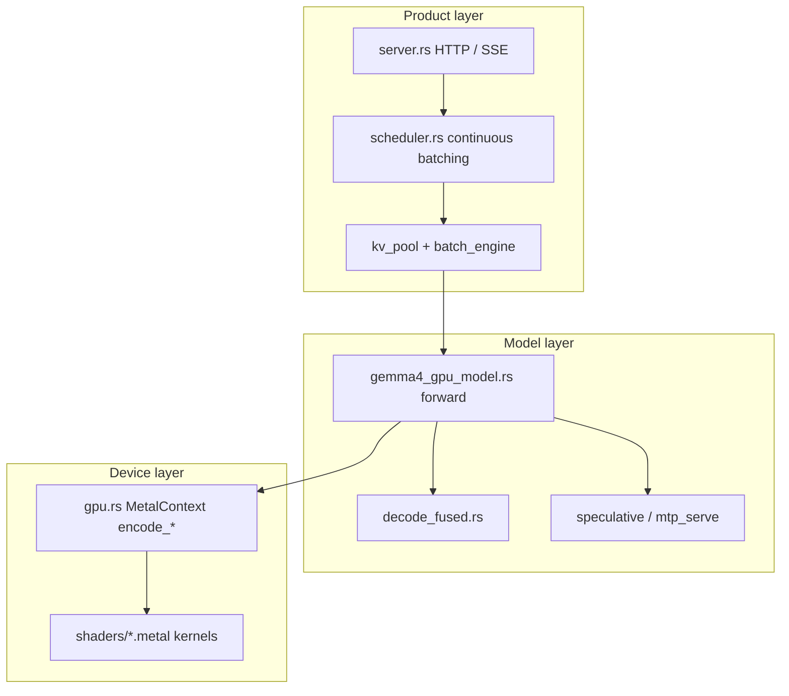

# 00 — How to Study This Codebase

## Purpose

This project is large (`gemma4_gpu_model.rs` and `gpu.rs` alone are thousands of
lines) and much of it was written or iterated with AI assistance. Studying it
like a normal open-source tour (“read every file top to bottom”) will fail.

Study it like a **systems lab notebook**: hypotheses, data paths, invariants,
and failure modes.

---

## The bar for “I understand this”

For any subsystem, you should be able to:

1. **Draw** the dataflow on a whiteboard (boxes + arrows).
2. **Name** the primary Rust type and the Metal kernel(s) involved.
3. **State one invariant** (e.g. “shared-KV layers never append”).
4. **Describe one bug** that violated that invariant (from `AGENTS.md` or code).
5. **Point at the env var** that switches the path (if any).

If you can only recite README bullets, you do not understand it yet.

---

## Study loop (use every chapter)

```text
┌──────────────┐     ┌──────────────┐     ┌──────────────┐
│  Diagram     │────▶│  Code cites  │────▶│  Checklist   │
│  (this doc)  │     │  (open files)│     │  (no peek)   │
└──────────────┘     └──────────────┘     └──────┬───────┘
                                                 │ fail?
                                                 ▼
                                          re-read diagram
                                          + run a tiny bench
```

Optional but strong: after Ch 09, run:

```bash
ATTENTION_KERNEL=auto LLAMA_KV_CACHE_TYPE=q4_0 \
  ./target/release/llama-sinks --gpu /path/to/model.gguf \
  --bench-decode --bench-decode-tokens 25,200
```

Numbers make the architecture real.

---

## Mental model: three layers



Always know which layer you are in. Confusion usually means you jumped layers
without noticing (e.g. discussing “attention” while looking at HTTP timeouts).

---

## What AI-assisted means for learning

| AI wrote | You must own |
|----------|----------------|
| Kernel bodies, encode helpers | When they run; what buffers they touch |
| Scheduler scaffolding | Admission vs prefill vs decode phases |
| Env-flag forests | Which flag changes *behavior* vs noise |
| Benchmark scripts | How to interpret tok/s vs thermal noise |

Publishing or interviewing: talk about **measurements and bugs**, not line count.

---

## Companion materials

| Material | Use for |
|----------|---------|
| This textbook | Structured curriculum (canonical) |
| [`AGENTS.md`](../../AGENTS.md) | What was tried; current best knobs |
| [`../archive/deprecated/`](../archive/deprecated/) | **Ignore for study** — outdated |

---

## Checklist

- [ ] I can name the three layers (product / model / device).
- [ ] I know the study bar (draw, name, invariant, bug, env).
- [ ] I will not confuse “read the blog” with “can explain hybrid KV append.”

**Next:** [01_system_map.md](01_system_map.md)
