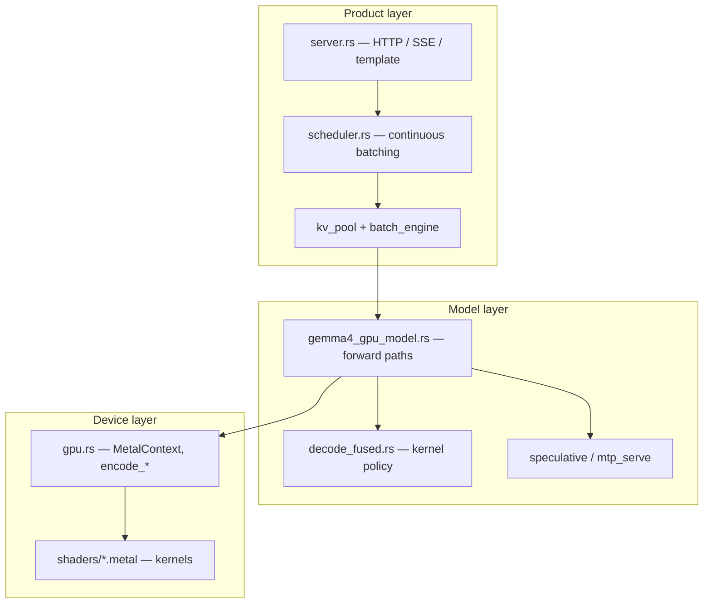

# 00 — How to Study This Codebase

## Why this chapter exists

This engine is ~32k lines of Rust and ~13k lines of Metal, with two files over
7000 lines each. Reading it front to back does not work: you will spend three
hours in `gpu.rs` learning that it contains 150 functions that all bind buffers
and dispatch kernels, and learn nothing about how a token is produced.

It also will not yield to the opposite approach — skimming for the "interesting
parts" — because the interesting parts are *interactions*: which kernel gets
selected, whether the KV append happened, what the anchor layer's stride is.
Those live between files.

So study it the way you would study an unfamiliar production system you are
about to be on call for: build a model, verify it against the code, and know
the failure modes.

---

## Part A — The bar

For any subsystem, "I understand it" means you can do five things without
looking:

1. **Draw** the dataflow: boxes, arrows, and shapes on the arrows.
2. **Name** the primary Rust type and the Metal kernel(s) involved.
3. **State an invariant** — something that must be true, e.g. "shared-KV layers
   never append."
4. **Describe a bug** that violated it, from `AGENTS.md` or from the code's
   comments.
5. **Point at the switch** — the env var or predicate that selects the path.

Point 4 is the one people skip and the one that matters most. A subsystem you
know only in its working state is a subsystem you cannot debug. Every chapter
here carries its bugs deliberately.

Self-test: pick "KV cache" right now and try the five. If you produce
"it stores keys and values so we don't recompute," you are at the README level.
Ch 06 exists to fix that.

---

## Part B — Four reading modes

Different questions need different reading strategies. Naming them helps you
notice when you are using the wrong one.

### B.1 Trace mode — "what happens when X?"

Pick an entry point, follow one path, ignore all branches you are not on. Use
for: understanding the decode path, a request's lifecycle, how a token becomes
logits.

Discipline: write the call chain down as you go, one function per line, with
line numbers. When you hit a branch, note the condition and pick a side. You
are producing an artifact, not just reading.

Chapters built for this mode: 09, 10, 12, 14.

### B.2 Contract mode — "what must be true here?"

Read a data structure and its invariants rather than a code path. Use for:
config, KV layout, buffer views, slot management.

Discipline: for each field, ask who writes it, who reads it, and what breaks if
they disagree. Ch 02's seven-field per-layer print came out of exactly this
exercise.

Chapters: 02, 03, 06, 13, 17.

### B.3 Kernel mode — "what do 256 threads do?"

Read a Metal kernel by asking, in order: how many threadgroups, what does one
threadgroup own, which threads cooperate, where are the barriers, what is in
threadgroup memory, and what is the bounds guard.

Discipline: put the host `encode_*` and the kernel signature side by side and
match every `[[buffer(i)]]`. Do this before reading the body. Nine of ten
kernel bugs are visible in that mapping (Ch 00c Part I).

Chapters: 00c, 05, 07, 08.

### B.4 Measurement mode — "why is it slow?"

Do not read code first. Predict from bytes and the ridge point (Ch 00c Part A),
then measure, then read only the code the measurement implicates.

Discipline: one variable at a time; record negative results. `AGENTS.md` is 15
numbered experiments, of which most were negative and *all* were useful.

Chapters: 15, plus the performance sections of 05, 07, 10.

---

## Part C — The study loop

```text
┌───────────────┐    ┌────────────────┐    ┌──────────────┐
│ mental model  │───▶│ verify in code │───▶│ checklist    │
│ + arithmetic  │    │ (open the file)│    │ (closed book)│
└───────────────┘    └────────────────┘    └──────┬───────┘
        ▲                                          │ fail
        └──────── re-derive on paper ◀──────────────┘
                  + run one measurement
```

Two rules make this work:

**Do the arithmetic before reading the code.** How many bytes does this move?
How many dispatches? How many threadgroups? If your estimate is 10× off from
reality, you have found a misunderstanding — which is the point.

**Close the book for the checklist.** Recognition is not recall. If you can
only produce the answer with the file open, you have not learned it yet.

### Make it real early

After Ch 09, run this:

```bash
ATTENTION_KERNEL=auto LLAMA_KV_CACHE_TYPE=q4_0 \
  ./target/release/llama-sinks --gpu /path/to/model.gguf \
  --bench-decode --bench-decode-tokens 25,200
```

You should see something near ~53 tok/s at 25 tokens and ~50 at 200. That gap
*is* the subject of Ch 07 and of `AGENTS.md`. Numbers make the architecture
stop being abstract.

---

## Part D — Three layers, and knowing which one you are in



Most confusion is an unnoticed layer jump — arguing about attention while
looking at an HTTP timeout, or about tok/s while looking at queue depth.

| Symptom | Layer | Typical cause |
|---|---|---|
| 429, hangs, truncated stream, wrong stop | Product | queue full, slot leak, stop-sequence policy, client disconnect |
| Garbage text, wrong-only-at-long-context | Model | missing KV append, wrong anchor, wrong layer type, window math |
| Wrong numbers, corruption, "works at 128 fails at 512" | Device | wrong pipeline, grid math, missing barrier, wrong dequant |

Diagnostic question that resolves layer ambiguity fast: **does it reproduce in
the CLI path (`--gpu` interactive) with one request?** If yes, it is Model or
Device. If no, it is Product.

---

## Part E — Verification habits

This codebase has no CPU reference implementation, so "does it look right" is
not a test. Build these habits early:

1. **Compare against llama.cpp** on the same GGUF and prompt. Ch 15 Part B.5
   has the scripts (`compare_outputs.py`, `prefill_correctness.py`).
2. **Use a needle test for long context.** Put `ZEBRA42` in the middle of a long
   prompt and ask for it. This catches window and anchor bugs that fluent text
   hides.
3. **Cross-check paths against each other.** `MTP_VERIFY_CROSSCHECK=1` runs
   parallel and sequential verify and compares every row. When you add a fast
   path, add its cross-check in the same commit.
4. **Ablate to attribute.** `PROFILE_ABLATE` deletes a sub-block; the time
   difference attributes cost without a profiler.
5. **Distrust fluency.** The most common failure in this system is grammatical,
   plausible, wrong output. Ch 02 Part K catalogues eight ways to get it.

---

## Part F — What "AI-assisted" changes about studying it

Much of this code was written or iterated with AI assistance. That has specific
consequences for a reader:

| What the assistant produced | What you must own |
|---|---|
| Kernel bodies, encode helpers | when each runs, what buffers it touches, its geometry |
| Scheduler scaffolding | admission vs prefill vs decode phase semantics |
| A forest of env flags | which flags change *behaviour* versus which are dead |
| Benchmark scripts | how to read tok/s against thermal and run-to-run noise |
| Ported kernels (ggml paths) | which constants encode the *source's* trade-offs |

That last row is the recurring trap and it appears three times in `AGENTS.md`
(#8 NWG=32, #3 `KQ_NR0`, M4 `TILED_EXT_MIN_Q=20`). A ported constant was tuned
for a different machine, a different context length, or a different fallback
kernel. Re-derive it.

If you are going to talk about this project — a write-up, an interview — talk
about measurements and bugs, not line counts. "We match llama.cpp at short
context and lose 12% at 200 tokens; here are the six things that were not the
cause" is a real engineering claim. "It has 150 Metal kernels" is not.

---

## Part G — Route map

Everyone should read 00b and 00c first. After that, pick by goal:

**"I want to understand GPU inference."**
00b → 00c → 05 → 06 → 07 → 08 → 09. Skip the server chapters.

**"I want to understand LLM serving."**
00b → 01 → 11 → 12 → 13. Then 09 for what a forward costs.

**"I want to optimize something."**
00c Part A → 15 → then whichever of 05/07/08/10 the measurement points at.

**"I want to port this architecture."**
00b → 02 → 03 → 17 → 06. The bug catalogue in 02 Part K is the value.

**"I want the whole thing."**
In order, 00 through 17. Budget 40–60 hours with the code open. Chapters
05, 07, and 10 are each a solid evening.

**Prerequisites that actually bind:** 07 needs 00b (online softmax) and 00c
(threadgroups). 10 needs 05 (mul_mm). 12 needs 11. 14 needs 07 and 12. 13 needs
06. Everything technical needs 00c.

---

## Part H — Companion materials

| Material | Use for |
|---|---|
| This textbook | the curriculum (canonical) |
| [`AGENTS.md`](../../AGENTS.md) | every experiment tried, current best knobs, open hypotheses |
| `benchmarks/` | raw measurement output referenced by Ch 10 and 15 |
| [`../archive/deprecated/`](../archive/deprecated/) | **ignore** — outdated |

`AGENTS.md` deserves special mention: it is a failure log, and it is the most
information-dense file in the repo. Read it once now for shape, and again after
Ch 07 when the experiments will mean something.

---

## Checklist

- [ ] I can state the five-point bar for understanding a subsystem.
- [ ] I can name the four reading modes and when each applies.
- [ ] I do the arithmetic before I read the code.
- [ ] I close the book for checklists.
- [ ] I can name the three layers and the question that disambiguates them.
- [ ] I know five verification habits, and why fluency proves nothing.
- [ ] I know why a ported constant is suspect.
- [ ] I have picked a route in Part G.

**Next:** [00b_transformers_first_principles.md](00b_transformers_first_principles.md)
