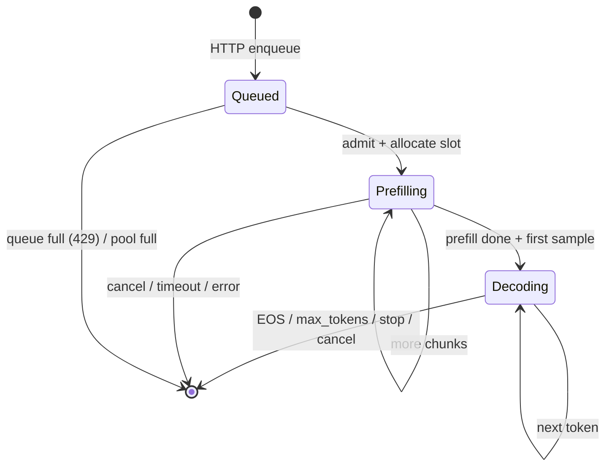

# 01 — System Map: Finding Your Way Around 32k Lines

Prerequisites: [00b](00b_transformers_first_principles.md) (what we compute)
and [00c](00c_gpu_and_metal_fundamentals.md) (how a GPU runs it).

This chapter is about **navigation**. The repo is ~32k lines of Rust and ~13k
lines of Metal, and two files (`gemma4_gpu_model.rs` at 9.2k lines and `gpu.rs`
at 7.8k) hold half of it. If you open those cold you will drown. By the end of
this chapter you should be able to take any question — "where does the KV
cache get written?", "who decides which attention kernel runs?" — and land on
the right function in under a minute.

---

# Part A — What this program is

A single-process, Metal-only inference server for Gemma4-family GGUF models,
with an OpenAI-compatible HTTP API, continuous batching, and optional
speculative decoding.

Deliberate non-goals, which explain a lot of the design:

- **No CPU fallback.** Every kernel is Metal. There is no "reference path" to
  fall back to, which is why correctness verification compares against
  llama.cpp externally (Ch 15 Part B.5) rather than against an internal CPU
  implementation.
- **No cross-process anything.** One binary, one GPU, one scheduler thread.
- **No dynamic graph.** The forward pass is hand-written Rust that encodes a
  fixed sequence of dispatches. There is no operator registry, no autograd, no
  graph optimizer. What you read is what runs.

That last point is the reason this codebase is worth studying: nothing is
hidden behind an abstraction layer. It is also why it is verbose.

---

# Part B — Module inventory

Sorted by size, because size tells you where the complexity is.

| Lines | File | Owns | Does **not** own |
|---|---|---|---|
| 9207 | `gemma4_gpu_model.rs` | model loading, all forward paths, scratch buffers, command buffers | pipeline creation, kernel dispatch details |
| 7776 | `gpu.rs` | `MetalContext`: device, queue, ~150 pipelines, every `encode_*` | command buffers, model semantics, layer order |
| 4731 | `server.rs` | Axum routes, chat template, tokenization, SSE, request validation | scheduling, GPU |
| 1064 | `mega_decode.rs` | experimental whole-token-in-one-kernel path | production decode |
| 976 | `main.rs` | CLI arg parsing, benches, dev test harnesses | anything reusable |
| 918 | `scheduler.rs` | continuous batching loop, admission, sampling policy | HTTP, GPU |
| 843 | `decode_fused.rs` | per-layer fused decode encoding | pipelines, buffers |
| 763 | `gguf.rs` | GGUF parse, mmap, tokenizer extraction | model semantics |
| 676 | `speculative.rs` | MTP draft-head weights and config | drafting logic |
| 625 | `mtp_serve.rs` | serial MTP serving loop | continuous batching |
| 615 | `layers.rs` | **legacy** Llama 3.2 layers | Gemma4 |
| 447 | `draft_tree.rs` | experimental tree drafting | production MTP |
| 418 | `ggml_flash_attn_ext.rs` | host side of the ported tiled ext attention | |
| 416 | `ggml_gemv.rs` | host side of ported ggml matvec | |
| 370 | `metrics.rs` | Prometheus text output | |
| 310 | `gpu_model.rs` | **legacy** Llama 3.2 GPU model | Gemma4 |
| 289 | `kv_pool.rs` | KV slot allocation, per-slot buffers | attention |
| 281 | `gemma4_mtp.rs` | draft chain orchestration, confidence | verify |
| 213 | `sampling.rs` | CPU sampling | stopping policy |
| 212 | `cache.rs` | **legacy** CPU KV cache | |
| 179 | `gemma4_config.rs` | architecture config, `KvCacheType` | weights |
| 169 | `model.rs` | **legacy** CPU model | |
| 164 | `weights.rs` | HF safetensors loading (legacy path) | |
| 146 | `batch_engine.rs` | facade: slots + prefill/decode entry points | policy |

Shaders:

| Lines | File | Contents |
|---|---|---|
| 7228 | `llama.metal` | norms, RoPE, KV append, decode attention, GeLU, PLE, sampling |
| 2111 | `ggml_mul_mv_q4.metal` | quantized matvec (Q4_0, Q4_K, Q6_K, ext batch variants) |
| 1585 | `ggml_flash_attn_ext.metal` | tiled flash attention (prefill + small-q verify) |
| 1033 | `ggml_mul_mm_q4.metal` | quantized matmul for prefill |
| 602 | `decode_mega.metal` | experimental mega-kernel |
| 403 | `ggml_flash_attn.metal` | multi-workgroup vec attention (`ATTENTION_KERNEL=ggml`) |

**Four files are legacy** — `layers.rs`, `gpu_model.rs`, `model.rs`,
`cache.rs`, plus `weights.rs` for the HF path. They implement Llama 3.2 on CPU
and an older GPU path. They compile, they are not in the Gemma4 hot path, and
reading them will teach you things that are no longer true. Skip them until you
are curious about history.

---

# Part C — The three entry paths

There is no single "main loop." There are three, and confusing them is the most
common orientation error.

## C.1 Server (the production path)

```text
main.rs                          --serve
  └─ server::run_server_with_mtp(...)
       ├─ create_router()                       (server.rs ~3465)
       │    POST /v1/chat/completions
       │      └─ chat_completions_stream()      (server.rs ~3019)
       │           ├─ encode_prompt()           template + tokenize (~2803)
       │           ├─ generation_params_from_request()  (~2573)
       │           ├─ enqueue_request()         try_send (~2547)
       │           └─ SSE loop reading StreamEvent
       └─ std::thread::spawn(Scheduler::run)    (scheduler.rs)
            loop {
              decode_active_round()             (scheduler.rs ~165)
                └─ BatchEngine::decode_batch()  (batch_engine.rs ~119)
                     └─ Gemma4GpuModel::forward_decode_batch_with_kv_slots()  (~8707)
              prefill_active_round()            (scheduler.rs ~249)
                └─ BatchEngine::prefill_batch() (batch_engine.rs ~73)
                     └─ forward_prefill_batch_with_kv_slots()  (~8763)
            }
```

Two threads: Tokio for HTTP, one dedicated OS thread for the scheduler. They
communicate over channels in both directions — a `std::sync::mpsc` for requests
in, a `tokio::sync::mpsc` per request for tokens out (Ch 12 Part A.1). That
choice is what keeps the scheduler lock-free and synchronous.

## C.2 CLI generate (the study path)

```text
main.rs --gpu model.gguf
  └─ interactive loop
       ├─ Gemma4GpuModel::forward_prefill(...)              (~8636)
       └─ Gemma4GpuModel::forward_single_token_sample(...)  (~3348)
            └─ forward_single_token_inner(...)              (~3364)
```

No scheduler, no pool: the model uses its **own** KV buffers. This is the path
to use when studying the forward pass, because there is nothing between you and
the dispatches. It is also the path `--bench-decode` uses.

## C.3 MTP serve (speculative)

```text
main.rs --gpu base.gguf --mtp draft.gguf --serve
  └─ mtp_serve::MtpScheduler         serial FIFO, one request at a time
       ├─ Gemma4MtpAssistant::draft_chain(...)   (gemma4_mtp.rs ~167)
       └─ Gemma4GpuModel::forward_verify_batch(...)  (~4959)
            └─ forward_verify_parallel(...)           (~5141)
```

Note what MTP gives up: continuous batching. The two designs are not
compatible without work (Ch 14 Part F), so MTP runs one sequence at a time.

---

# Part D — The decode call chain, in full

This is the chain to know by heart. It is the hot path.

```text
scheduler.rs   decode_active_round
                 ├─ prepare_decode_token(req)         per request: sample previous logits,
                 │                                     check stop conditions
                 └─ BatchEngine::decode_batch(tokens, slots)
batch_engine.rs      └─ if 1 request  → forward_single_token_with_kv_slot
                        else          → forward_decode_batch_with_kv_slots
                                        (chunked by max_decode_batch_size)

gemma4_gpu_model.rs  forward_single_token_with_kv_slot
                       ├─ alias_kv_from_pool(slot)     point at the slot's buffers
                       └─ forward_single_token_inner   (~3364)

                     forward_single_token_inner
                       ├─ new_command_buffer + encoder
                       ├─ encode_embed / rope_fill_decode
                       ├─ for layer in 0..42:
                       │    if fused_decode_eligible()
                       │       → decode_fused::encode_fused_decode_layer  (~117)
                       │    else
                       │       → inline per-op encodes (the legacy path, same file)
                       ├─ final norm + lm_head + softcap
                       ├─ (optional GPU argmax)
                       └─ commit + wait_until_completed + read back

decode_fused.rs      encode_fused_decode_layer
                       ├─ attention: pick from the fusion ladder
                       │    encode_attention_full_fused_q4_0            (has_kv)
                       │    encode_attention_flash_decode_qknorm_rope   (shared KV)
                       │    encode_attention_ggml_q4_0                  (auto ≥ threshold)
                       ├─ o_proj + rmsnorm_acc
                       ├─ encode_fused_mlp_layer      (4-branch choice)
                       └─ encode_fused_ple_layer

gpu.rs               encode_*  → set_compute_pipeline_state
                                 set_buffer / set_bytes
                                 dispatch_thread_groups
```

Four observations that make this readable:

1. **Only `forward_*` functions create command buffers.** Everything below just
   appends. So "when does the GPU actually run?" always has the same answer:
   at the `commit()` in the `forward_*` that started it.
2. **`decode_fused.rs` is where policy lives.** The `if` cascades that pick
   kernels by weight format, KV type, and context length are all there. When
   you want to know *why* a particular kernel ran, read `decode_fused.rs`, not
   `gpu.rs`.
3. **`gpu.rs` is mechanism, not policy.** An `encode_*` function binds buffers
   and dispatches. It does not decide anything except dispatch geometry.
4. **There are two decode paths.** The fused one (`FUSED_DECODE=1`, default)
   and an older per-op path inline in `gemma4_gpu_model.rs`. Both work; the
   fused one is faster. `AGENTS.md` #4 measured them and found the *bottleneck*
   is in both, which is how they knew fusion was not the issue.

---

# Part E — The prefill call chain

```text
scheduler.rs   prefill_active_round
                 ├─ plan_prefill_round()               water-filling token budget (~476)
                 ├─ prepare_prefill_chunk()            slice ids, set want_logits (~570)
                 └─ BatchEngine::prefill_batch()
gemma4_gpu_model.rs  forward_prefill_batch_with_kv_slots  (~8763)
                       └─ per layer, per segment:
                            rmsnorm_batch
                            encode_prefill_attention_qkv      (mul_mm)
                            qkv split / per-head norms / transpose
                            encode_rotary_batch
                            encode_kv_batch_append_strided_*
                            attention: flash_attn_ext  or  attention_causal_strided_*
                            transpose back, o_proj, rmsnorm_acc_batch
                            MLP batch (mul_mm gate/up, gelu_mul, down)
                            PLE batch
```

The structural difference from decode is not the kernels, it is **the command
buffer boundary**: prefill commits roughly one command buffer per layer, decode
commits one per token for all 42 layers. Why: prefill dispatches are large
(milliseconds each), so per-layer commits let the CPU stay ahead without
inflating latency; decode dispatches are microseconds, so per-token batching is
essential to amortize submission cost. Ch 10 Part F.

---

# Part F — Who owns which memory

Memory bugs are ownership bugs, so keep this straight:

| Memory | Allocated by | Lives as long as | Notes |
|---|---|---|---|
| Weights | `Gemma4GpuModel::load_*` | process | suballocated; accessed via `BufferView` |
| Decode scratch (`hidden_buf`, `q_buf`, …) | model constructor | process | sized to the **max** over layers (Ch 17 Part A) |
| Prefill scratch | model constructor | process | sized to `max_prefill_seq`; caps chunk size |
| KV cache (CLI path) | model constructor | process | model-owned; `k_cache[layer]` |
| KV cache (server path) | `KvCachePool::new` | process | `slots × layers × 2` buffers |
| Per-request state | `ActiveRequest` in scheduler | request | tokens, cursor, params, cancel flag |
| Logits readback | per forward call | call | `Vec<f32>` of 262144 |

The subtle one is the KV cache. In the server path the model still has
`k_cache`/`v_cache` fields, and `alias_kv_from_pool(slot)` makes them *point
at* the slot's buffers before each forward. So the forward code never knows
whether it is running CLI-style or pool-style. Elegant, and a trap: if you add
a forward path and forget the alias call, you will write into whatever slot was
used last. Ch 13 Part C.

---

# Part G — Layering rules

These are conventions, not compiler-enforced, and following them is what keeps
the code navigable:

```text
server.rs      may call: scheduler channels, tokenizer
               must NOT: touch GPU or model

scheduler.rs   may call: BatchEngine, sampling, kv_pool
               must NOT: create Metal objects

batch_engine   may call: Gemma4GpuModel forward_*, KvCachePool
               must NOT: encode dispatches

model / fused  may call: MetalContext encode_*, create command buffers
               must NOT: know about HTTP or requests

gpu.rs         may call: Metal API
               must NOT: know about layers, requests, or policy beyond geometry
```

When you are lost, ask which layer your question belongs to. "Why is this token
wrong?" is a model/kernel question. "Why is this request slow?" could be
scheduler (queue wait) or model (kernel). "Why did this 429?" is server.

---

# Part H — Navigation recipes

Concrete greps that answer the questions you will actually have.

**"Which kernel runs for X?"** Find the encode call in `decode_fused.rs`, then
the pipeline field in `gpu.rs`, then the kernel name in the shader:

```bash
rg "encode_attention" src/decode_fused.rs
rg "fn encode_attention_full_fused_q4_0" -A 30 src/gpu.rs
rg "kernel void flash_decode_full_fused_q4_0" src/shaders/llama.metal
```

**"What does this env var do?"** Every knob is read in one place, usually a
small helper:

```bash
rg "ATTENTION_KERNEL|attention_use_ggml_for_layer_kv" src/gpu.rs
```

**"Where is the KV cache written?"**

```bash
rg "encode_kv_append|kv_batch_append" src/ --type rust
rg "kernel void kv_cache_append" src/shaders/llama.metal
```

**"Which forward paths exist?"**

```bash
rg "pub fn forward_" src/gemma4_gpu_model.rs
```

**"What is bound to buffer index 7 in this kernel?"** Put the shader signature
and the encode function side by side and count. This is mechanical and it is
how you find nine out of ten kernel bugs (Ch 00c Part I).

**"Is this code even reachable?"** Several paths are experiments
(`mega_decode.rs`, `draft_tree.rs`, `ATTENTION_KERNEL=mwg`). Check for an env
gate before you spend an hour reading:

```bash
rg "mega_decode|MEGA_DECODE" src/*.rs
```

---

# Part I — Request lifecycle

```text
1. HTTP receives ChatCompletionRequest
2. Chat template applied → token ids                     (server.rs)
3. InferenceRequest { input_ids, params, response_tx, cancel } built
4. SyncSender::try_send  → 429 if the queue is full
5. Scheduler admits: allocate KvSlot, phase = Prefilling, cursor = 0
6. Each tick:
     a. decode_active_round   — all Decoding requests, batched
     b. prefill_active_round  — Prefilling requests, within a token budget
7. Prefill completes → sample first token → phase = Decoding
8. Each decode step → sample → StreamEvent::Token → SSE
9. EOS / max_tokens / stop sequence / client disconnect / timeout
     → StreamEvent::Done → release slot
```



Note step 6: **decode runs before prefill in every tick.** That is a latency
decision — already-streaming requests keep their inter-token gap steady even
when a new prompt arrives. Ch 12 Part B.

---

# Part J — Capacity and the knobs that set it

```text
concurrent generations ≈ LLAMA_KV_POOL_SLOTS      (default 4)
queued requests        ≈ LLAMA_QUEUE_DEPTH        (default 32)
memory ≈ weights + slots × layers × 2 × kv_heads × ctx × row_bytes
```

| Env | Default | Effect |
|---|---|---|
| `LLAMA_KV_POOL_SLOTS` | 4 | concurrency ceiling; the scarce resource |
| `LLAMA_QUEUE_DEPTH` | 32 | burst absorption only, not throughput |
| `LLAMA_CTX_SIZE` | 16384 | KV capacity per slot (cap 200000) |
| `LLAMA_KV_CACHE_TYPE` | f16 | `q4_0` → ~3.5× less KV memory |
| `LLAMA_REQUEST_TIMEOUT_SECS` | 300 | per-request wall clock |
| `LLAMA_PREFILL_TOKENS_PER_TICK` | unset | fair-share prefill budget |
| `ATTENTION_KERNEL` | specialized | `auto` for the hybrid (Ch 07) |

Slots × context × row_bytes is the term that will OOM you. At 16384 context in
F16 that is ~1 GB per slot for E4B (Ch 13 Part A.2), so 4 slots is 4 GB of KV
on top of 2.5 GB of weights. Switching to `q4_0` KV takes the same 4 slots down
to ~1.2 GB — which is the real reason the hybrid attention work in `AGENTS.md`
targets Q4_0 caches.

---

## Exercises

1. Without grepping, name the file that decides whether the ggml MWG attention
   kernel is used for a given layer. Then verify.
2. Trace `POST /v1/chat/completions` to the first `dispatch_thread_groups`,
   naming every function. Compare against Part C.1 and Part D.
3. `forward_single_token_inner` is at line 3364 of a 9207-line file. What are
   the other 8000 lines? Categorize by grepping `pub fn` and `fn`.
4. Why does `batch_engine.rs` exist at all, given it is only 146 lines and
   mostly forwards calls? What would break if the scheduler called the model
   directly?
5. You want to add a `POST /v1/cancel` endpoint. Which files must change, and
   which must not? (Ch 11 Part F and Ch 12 Part F have the answer.)

## Checklist

- [ ] Draw the server path from HTTP to a Metal dispatch, with function names.
- [ ] Name the three entry paths and what each is for.
- [ ] Explain which layer owns command buffers, and why that matters.
- [ ] Distinguish policy (`decode_fused.rs`) from mechanism (`gpu.rs`).
- [ ] List the five legacy files and say why they are misleading.
- [ ] Explain the KV aliasing trick and the bug it invites.
- [ ] Compute total memory for 4 slots at 16384 context, F16 and Q4_0.

**Next:** [02_gemma4_architecture.md](02_gemma4_architecture.md)
