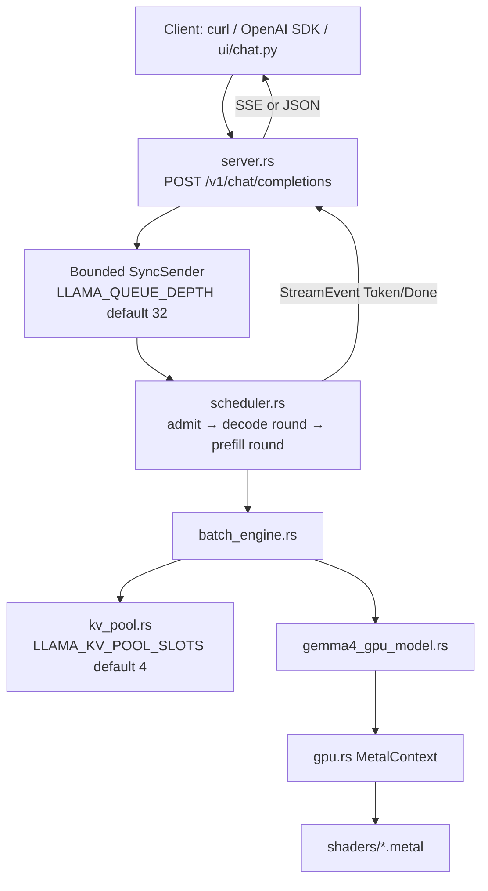
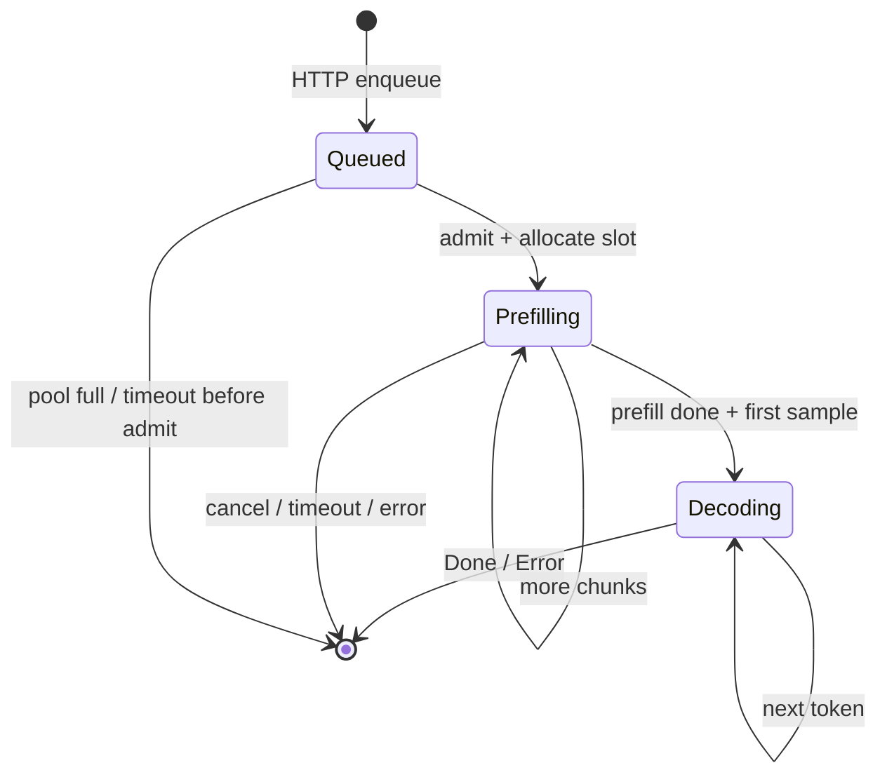

# 01 — System Map

## One-sentence summary

A client sends an OpenAI-style chat request; the HTTP server enqueues an
`InferenceRequest`; the scheduler admits it into a **KV pool slot**, runs
**chunked prefill** then **decode rounds** through `BatchEngine` →
`Gemma4GpuModel` → Metal kernels; tokens stream back as SSE.

---

## Big picture



### Alternate entry: CLI (no server)

```text
main.rs --gpu model.gguf
  → interactive generate / benches
  → Gemma4GpuModel::forward_* directly (model-owned KV, not pool)
```

### Alternate serve: MTP

```text
main.rs --gpu base.gguf --mtp draft.gguf --serve
  → mtp_serve::MtpScheduler  (serial FIFO — NOT multi-slot continuous batching)
```

---

## File map (production path)

| File | Job |
|------|-----|
| `src/main.rs` | CLI: GGUF vs HF, `--serve`, benches, `--mtp` |
| `src/server.rs` | Axum routes, tokenization, chat template, queue, runtime config |
| `src/scheduler.rs` | Continuous batching loop over active requests |
| `src/batch_engine.rs` | Thin bridge: slots + `prefill_*` / `decode_*` |
| `src/kv_pool.rs` | Per-slot GPU K/V buffers + seq_len |
| `src/gemma4_gpu_model.rs` | Load, forward prefill/decode/batch/verify |
| `src/decode_fused.rs` | Fused per-layer decode encoding |
| `src/gpu.rs` | Device, pipelines, every `encode_*` |
| `src/gguf.rs` | GGUF parse + tokenizer extract |
| `src/gemma4_config.rs` | Arch config + `KvCacheType` |
| `src/sampling.rs` | CPU sampling (server path) |
| `src/metrics.rs` | Prometheus text |
| `src/mtp_serve.rs` / `speculative.rs` / `gemma4_mtp.rs` | Speculative MTP |
| `src/shaders/` | Metal kernels |

Legacy (study later if curious): `gpu_model.rs`, `model.rs`, `layers.rs` — Llama 3.2 paths.

---

## Request lifecycle (happy path)

```text
1. HTTP receives ChatCompletionRequest
2. Apply chat template → token ids
3. Build InferenceRequest { input_ids, GenerationParams, response_tx, cancel }
4. SyncSender::try_send  (fail if queue full → 503-ish error path)
5. Scheduler admit:
     - allocate KvSlot from pool
     - ActivePhase::Prefilling, cursor=0
6. Each scheduler tick:
     a. decode_active_round  (all Decoding requests, batched)
     b. prefill_active_round (Prefilling requests, token budget / tick)
7. Prefill finishes → sample first completion token → Decoding
8. Each decode step → sample → StreamEvent::Token
9. EOS / max_tokens / cancel / timeout → Done → release slot
```



---

## Where time goes (intuition)

| Phase | Dominant cost | Scales with |
|-------|---------------|-------------|
| Prefill | Matmul (`mul_mm`) + flash attn ext | prompt length, layers |
| Decode | Matvec (QKV/MLP/lm_head) + attention over KV | **kv_seq** (attention), constant for matvec |
| Server overhead | Queue wait, sampling, SSE | concurrency |

Decode matvecs are ~constant per token; attention reads grow with context.
That is why short-context benches look great and long chats fall off.
See Ch 15 and `AGENTS.md`.

---

## Key runtime knobs (defaults from code)

| Env | Default | Meaning |
|-----|---------|---------|
| `LLAMA_QUEUE_DEPTH` | 32 | Admission queue capacity |
| `LLAMA_KV_POOL_SLOTS` | 4 | Concurrent live requests (GPU KV) |
| `LLAMA_REQUEST_TIMEOUT_SECS` | 300 | Per-request wall timeout |
| `LLAMA_PREFILL_TOKENS_PER_TICK` | unset | Optional fair prefill budget |
| `LLAMA_CTX_SIZE` | 16384 | KV capacity (cap 200000) |
| `LLAMA_KV_CACHE_TYPE` | f16 | Prefer `q4_0` for decode speed/memory |
| `ATTENTION_KERNEL` | specialized | Prefer `auto` for hybrid |
| `LLAMA_MAX_PREFILL_SEQ` | engine-derived | Max tokens per prefill chunk |

---

## Capacity mental model

```text
Max concurrent generations ≈ LLAMA_KV_POOL_SLOTS
Max waiting requests      ≈ LLAMA_QUEUE_DEPTH
Memory ≈ weights + (slots × layers × kv_heads × ctx × row_bytes × 2 for K+V)
```

Slots are the scarce GPU resource. Queue depth only absorbs bursts until a slot frees.

---

## Checklist

- [ ] Draw client → HTTP → queue → scheduler → batch engine → model → Metal.
- [ ] Explain why pool slots ≠ queue depth.
- [ ] Name what MTP changes (serial scheduler).
- [ ] Locate defaults for queue depth and pool slots in `server.rs`.

**Next:** [02_gemma4_architecture.md](02_gemma4_architecture.md)
