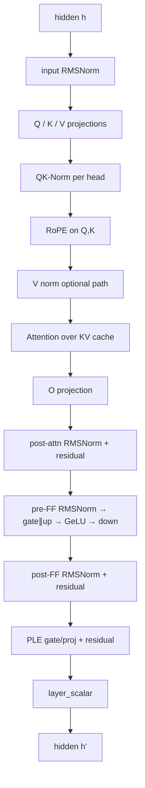
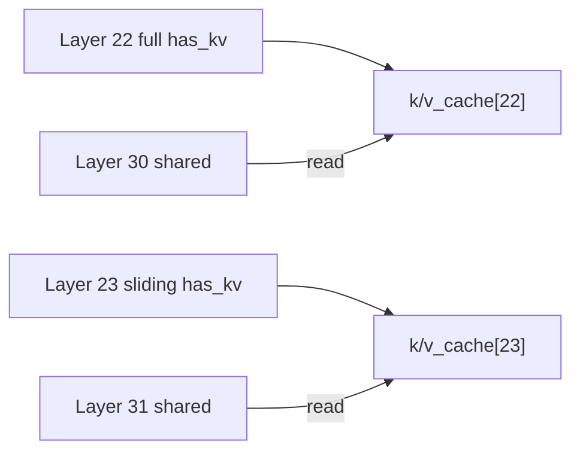

# 02 — Gemma4 Architecture (What the Engine Must Implement)

## Why this chapter exists

Every weird branch in `gemma4_gpu_model.rs` exists because Gemma4 is not a
plain Llama clone. If you skip this, kernel code looks arbitrary.

Primary types: `Gemma4Config` / `Gemma4TextConfig` in `src/gemma4_config.rs`.

---

## Spec snapshot (E4B-class; verify against your GGUF/config)

| Property | Typical E4B |
|----------|-------------|
| Dense transformer | Yes (not MoE) |
| Hidden size | 2560 |
| Layers | 42 |
| Q heads | 20 |
| KV heads | 4 (GQA, 5 groups) |
| Intermediate | 10240 (may vary per layer on E2B) |
| Vocab | ~262144 |
| Sliding head_dim | 128 |
| Full / global head_dim | 512 |
| PLE dim (`hidden_size_per_layer_input`) | 256 |
| Sliding window | from config (`sliding_window`) |
| Final logit softcap | 30 |

E2B differs in size and may use `intermediate_sizes` per layer — always read
`config` / GGUF metadata for the file you load.

---

## Layer stack (one transformer block)



After all layers: **final RMSNorm → lm_head → logits** (+ softcap on CPU for
logits-mode paths).

---

## 1. Mixed attention: sliding vs full

`layer_types[i]` is `"sliding_attention"` or `"full_attention"`.

| Kind | Head dim | What it attends |
|------|----------|-----------------|
| Sliding | `head_dim` (128) | Last `sliding_window` tokens |
| Full | `global_head_dim` (512) | Full causal context (up to capacity) |

```rust
// gemma4_config.rs
pub fn layer_head_dim(&self, layer_idx: usize) -> usize {
    if self.is_full_attention(layer_idx) { self.global_head_dim } else { self.head_dim }
}
```

**Implication for Metal:** kernels are specialized per head dim (`h128`, `h256`,
`h512`). Scratch buffers must be sized for `max_head_dim`.

---

## 2. GQA

```text
num_attention_heads / num_key_value_heads = num_kv_groups
Example: 20 / 4 = 5  → each KV head serves 5 Q heads
```

KV cache stores **KV heads only**. Attention maps query head `h` → KV head
`h / num_kv_groups`.

Two decode strategies (see Ch 07):

- One threadgroup per **Q head** (simple; may re-read KV).
- One threadgroup per **KV head** (GQA-aware; share KV loads).

---

## 3. Shared KV layers

Second half of the network often sets `has_kv = false` and points
`kv_source_layer` at an earlier **anchor** layer of the same attention type.

```text
Layer  i (has_kv=true):  project K,V → append cache[i] → attend using cache[i]
Layer  j (has_kv=false): project Q only → attend using cache[kv_source_layer]
```



**Invariant:** shared layers never append. Wrong `kv_source_layer` → garbage
attention (see `AGENTS.md` experiment 12 — llama.cpp-style anchors).

---

## 4. QK-Norm

Per-head RMSNorm on Q and K **before** RoPE/attention. With QK-norm, Gemma4
often uses `attention_scale ≈ 1.0` instead of classic `1/sqrt(d)`.

Fused kernels (`attention_flash_decode_qknorm_rope_*`) fold norm+RoPE into the
attention dispatch to cut launches.

---

## 5. RoPE (two parameter sets)

`rope_parameters.full_attention` vs `sliding_attention` may differ in `rope_theta`
and factors. Decode fills cos/sin tables per position (`rope_fill_decode`).

**Cache stores already-rotated K.** Position used for RoPE is the **global**
token position, not window-relative.

---

## 6. Post-norm + layer scalar

Gemma4 uses post-attention / post-FF norms on the residual path (see encode
helpers `encode_proj_norm_residual`). A per-layer `layer_scalar` scales the
hidden state to stabilize depth.

---

## 7. Per-Layer Embeddings (PLE)

Each layer injects a token-conditioned residual:

```text
ple_token[layer]  ← embedding table lookup (CPU mmap, per token × layer)
ple_ctx           ← projection from main residual (GPU)
combine → gate → GeLU → project back to hidden → residual (+ norm)
```

PLE tables are large. Prefill win in `AGENTS.md` E22: keep some PLE projections
as **dense f16 + mul_mm**, not requantized Q4 — wrong quant destroyed throughput.

---

## 8. Logit softcapping

```text
logits = cap * tanh(logits / cap)   # typically cap = 30
```

Applied on final logits (and sometimes attention scores in reference impls).
Server logits path does CPU softcap after readback when not sampled on GPU.

---

## 9. Activation

Config `hidden_activation` — Gemma4 MLP uses **GeLU** (not Llama SiLU/SwiGLU
naming). Kernels: `gelu_mul`, fused gate∥up+GeLU variants.

---

## Layer loop pseudocode

```text
h = embed(token)
ple_bundle = prepare_ple(token, h)          # optional pre-pass

for layer in 0..num_layers:
    h = attention_block(layer, h)           # respects has_kv, sliding/full, head_dim
    h = mlp_block(layer, h)
    h = ple_block(layer, h, ple_bundle)
    h *= layer_scalar[layer]

logits = lm_head(rms_norm(h))
logits = softcap(logits)
```

---

## Checklist

- [ ] Sliding vs full: head dims and window behavior.
- [ ] GQA: 20 Q / 4 KV → mapping formula.
- [ ] Shared KV: what is skipped vs what still runs (Q still projected).
- [ ] Why PLE exists and why its dtype/quant choice matters for prefill.
- [ ] Softcap formula.

**Next:** [03_weights_and_gguf.md](03_weights_and_gguf.md)
