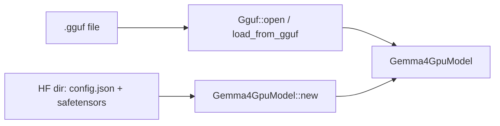
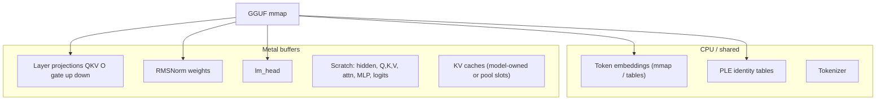

# 03 — Weights & GGUF Loading

## One-sentence summary

Production path memory-maps a **community GGUF**, uploads quantized weight
tensors into Metal buffers (often zero-copy friendly), builds a tokenizer from
embedded GGUF data, and constructs `Gemma4GpuModel` with per-layer
`BufferView`s — without a separate slow “quantize everything to Q4_0 cache”
step for day-to-day GGUF runs.

---

## Two load paths



| Path | Entry | When to use |
|------|-------|-------------|
| GGUF | `Gemma4GpuModel::load_from_gguf` | Default; K-quant Metal; fast cold load |
| HF | `Gemma4GpuModel::new(model_dir)` | Research / non-GGUF; may quantize/cache |

CLI: `--gpu path` — if path ends with `.gguf` (or is a file), GGUF path; else HF directory.

---

## GGUF mental model

```text
GGUF file
├── header (magic, version)
├── metadata KV (arch, counts, tokenizer, chat template…)
└── tensor directory + blob
    ├── token_embd.weight
    ├── blk.N.attn_q.weight   (ggml type: Q4_K, Q6_K, F16, …)
    ├── blk.N.attn_k.weight
    ├── …
    ├── output_norm.weight
    └── output.weight / tied embd
```

Key modules:

| Symbol | File | Role |
|--------|------|------|
| `Gguf` | `gguf.rs` | mmap parse, tensor lookup |
| `TensorInfo` | `gguf.rs` | name, shape, ggml type, offset |
| `build_tokenizer_from_gguf` | `gguf.rs` | rebuild HF-style tokenizer |
| `dequant_type_to_f32` | `gguf.rs` | CPU dequant helpers when needed |

Weights for Metal stay in **native ggml block formats** where possible (Q4_K /
Q6_K). Matvec/mul_mm kernels dequant on the fly (Ch 05).

---

## What ends up where



Decode embedding lookup is often **CPU index → f32 scratch → `write_buffer` to
`hidden_buf`**. That is intentional: huge emb tables, tiny per-token traffic.

---

## Per-layer weight handles

Conceptual `Gemma4GpuLayer` fields (names approximate — read the struct):

```text
input_layernorm, post_attention_layernorm, pre_feedforward_layernorm, …
q_proj, k_proj, v_proj, o_proj
gate_proj, up_proj, down_proj
optional fused packs: gate_up_proj / stacked prefill views
ple: per_layer_input_gate, per_layer_projection, …
has_kv: bool
kv_source_layer: usize
head_dim / attention type derived from config
```

---

## WeightFormat & experiments

Env / format switches (see `gpu.rs` / model load) may select Q4_0 vs K-quants,
optional Q3 layer ranges, F16 retention for sensitive tensors. Treat these as
**lab knobs**; GGUF Q4_K_M is the everyday path in README.

Historical HF path built a `model.q4cache` — if you change PLE dtype policy,
**delete the cache** so you do not load stale quant (noted in `AGENTS.md` E22).

---

## Cold load story (why GGUF matters)

| Approach | Cold start |
|----------|------------|
| HF bf16 → quantize all → upload | tens of seconds |
| GGUF mmap + upload typed buffers | sub-second to few seconds |

README claims mmap zero-copy style upload for GGUF K-quants — study
`load_from_gguf` for the exact Buffer creation (`new_buffer_with_bytes` vs copy).

---

## Tokenizer & chat template

Server needs:

1. Tokenizer (from GGUF or `tokenizer.json`).
2. Chat template (GGUF metadata or tokenizer config) → `apply_chat_template` in
   `server.rs`.

Wrong template → wrong special tokens → nonsense generations that look like
“model bugs.”

---

## Checklist

- [ ] GGUF vs HF entry points named.
- [ ] Which tensors typically stay CPU-side vs GPU.
- [ ] Why decode still memcpy’s a hidden vector each token.
- [ ] What to delete when changing quant policy on HF cache path.

**Next:** [04_metal_runtime.md](04_metal_runtime.md)
