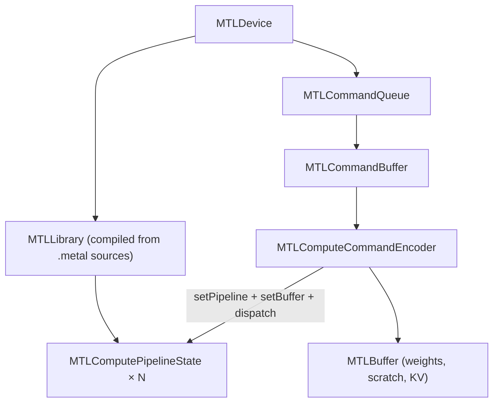

# 04 — Metal Runtime (`MetalContext`)

## One-sentence summary

`MetalContext` owns the Apple GPU device, command queue, **compiled pipeline
states** for every shader entry point, and hundreds of `encode_*` helpers that
bind buffers/bytes and dispatch threadgroups into a compute encoder.

File: `src/gpu.rs` (largest “device layer” file). Shaders: `src/shaders/*.metal`.

---

## Objects you must know



| Concept | Role |
|---------|------|
| **Pipeline state** | One compiled kernel entry (`matvec_q4_…`, `attention_flash_…`) |
| **Command buffer** | Ordered list of encoded GPU work; `commit` then usually `wait` |
| **Encoder** | Records dispatches into the CB |
| **Buffer** | GPU-visible memory (`StorageModeShared` common on Apple Silicon) |
| **BufferView** | Host-side `{ buffer, offset, … }` into a region |

Unified memory: CPU and GPU share pointers; still pay for **coherence and
submit latency**, not PCIe copies like discrete NVIDIA.

---

## Lifetime of one decode token (device view)

```text
cmd = queue.new_command_buffer()
enc = cmd.new_compute_command_encoder()
  encode_rope_fill_decode(...)
  encode_ple_prepass(...)          # optional
  for layer:
      encode_fused_or_unfused_attn(...)
      encode_mlp(...)
      encode_ple_layer(...)
  encode_final_norm_lm_head(...)
enc.end_encoding()
cmd.commit()
cmd.wait_until_completed()         # CPU blocks
read logits or sample token
```

**Invariant for the simple path:** one CB per token, CPU waits. Pipelining
multiple CBs (`METAL_N_CB` ideas) is experimental territory — see Ch 15 E21.

Dispatch overhead (~µs × hundreds of kernels) is real but often **not** the
dominant gap vs llama.cpp (`AGENTS.md` experiment 1).

---

## Shader inventory

| File | Responsibility |
|------|----------------|
| `llama.metal` | Core: matvec variants, norms, RoPE, GeLU, KV append, flash decode fused family, PLE, sample |
| `ggml_mul_mv_q4.metal` | llama.cpp-style Q4_0/Q4_K/Q6_K matvec + **ext** small-batch |
| `ggml_mul_mm_q4.metal` | Prefill matrix×matrix |
| `ggml_flash_attn.metal` | Decode MWG vec FA + reduce |
| `ggml_flash_attn_ext.metal` | Prefill tiled FA |
| `decode_mega.metal` | Optional single mega-kernel graph |

At init, `MetalContext::new` compiles these into pipeline fields. Missing
pipeline ⇒ runtime panic or fallback path.

---

## Encode helper pattern

Typical shape:

```text
encode_FOO(encoder, buffers..., dims..., env-selected PSO)
  encoder.set_compute_pipeline_state(&self.pso_foo)
  encoder.set_buffer(0, Some(&buf_a), offset)
  ...
  encoder.set_bytes(... params ...)
  encoder.dispatch_thread_groups(grid, threads_per_group)
```

Grid sizes are part of correctness (wrong TG count → silence or garbage).
Attention grids depend on heads vs KV heads (GQA).

---

## Feature flags live here

`gpu.rs` centralizes env parsing for attention/MLP fusion. Critical ones:

### Attention mode

```text
ATTENTION_KERNEL=
  specialized  (default)  — fused flash family
  ggml                    — always ggml MWG decode
  auto                    — fused if kv_seq < 128 else ggml MWG
  generic
```

```rust
// gpu.rs
pub fn attention_use_ggml_for_layer_kv(has_kv: bool, kv_seq: u32) -> bool {
    match attention_kernel_mode() {
        Ggml => true,
        Specialized | Generic => false,
        Auto => kv_seq >= 128,
    }
}

pub fn needs_explicit_kv_append(has_kv: bool, effective_kv_seq: u32) -> bool {
    // ggml path does NOT fuse append → must encode_kv_append first
}
```

**Study bug (AGENTS #15):** `auto` left `fused_kv_attention_enabled()` true while
switching to ggml ⇒ skipped append ⇒ attending without current token K/V ⇒
garbage after ~128 tokens. Fix: `needs_explicit_kv_append`.

### Other important families

| Family | Examples |
|--------|----------|
| Decode fusion | `FUSED_DECODE`, `FUSED_KV_ATTN`, `FUSED_QKV`, `MEGA_KERNEL` |
| Prefill | `PREFILL_FLASH_ATTN`, `PREFILL_MUL_MM`, `PREFILL_MLP_F16`, stacked QKV/gate |
| GQA | `ATTENTION_GQA_Q4`, `ATTENTION_GQA_F16` (opt-in; history of correctness issues) |
| Profile | `PROFILE_ABLATE`, `PROFILE_PHASES`, `PROFILE_DISPATCHES` |

---

## Scratch buffers

Model holds reusable GPU scratch: `hidden`, `normed`, `q/k/v`, `attn_out`,
MLP intermediates, logits, RoPE tables, PLE temps, MTP verify rows, etc.

**Rule:** scratch size ≥ worst case (`max_head_dim`, max intermediate, batch,
verify seq). Undersized scratch = classic MTP/prefill corruption
(`AGENTS.md` MTP M1: draft attention scratch used `hidden_head` not 512).

---

## CPU ↔ GPU boundary

| Direction | Typical payload |
|-----------|-----------------|
| CPU→GPU | embed row, PLE token rows, RoPE params, host scalars |
| GPU→CPU | 4-byte sample **or** full logits (`vocab × f32`) |

Server scheduler usually wants **logits** then samples on CPU (`sampling.rs`)
for penalties. CLI sample mode may use GPU `sample_min_p`.

---

## Checklist

- [ ] Device / queue / PSO / CB / encoder roles.
- [ ] One-token CB lifecycle including `wait_until_completed`.
- [ ] Name all six shader files’ jobs.
- [ ] Explain `ATTENTION_KERNEL=auto` threshold and KV append hazard.

**Next:** [05_quantization_matmul.md](05_quantization_matmul.md)
