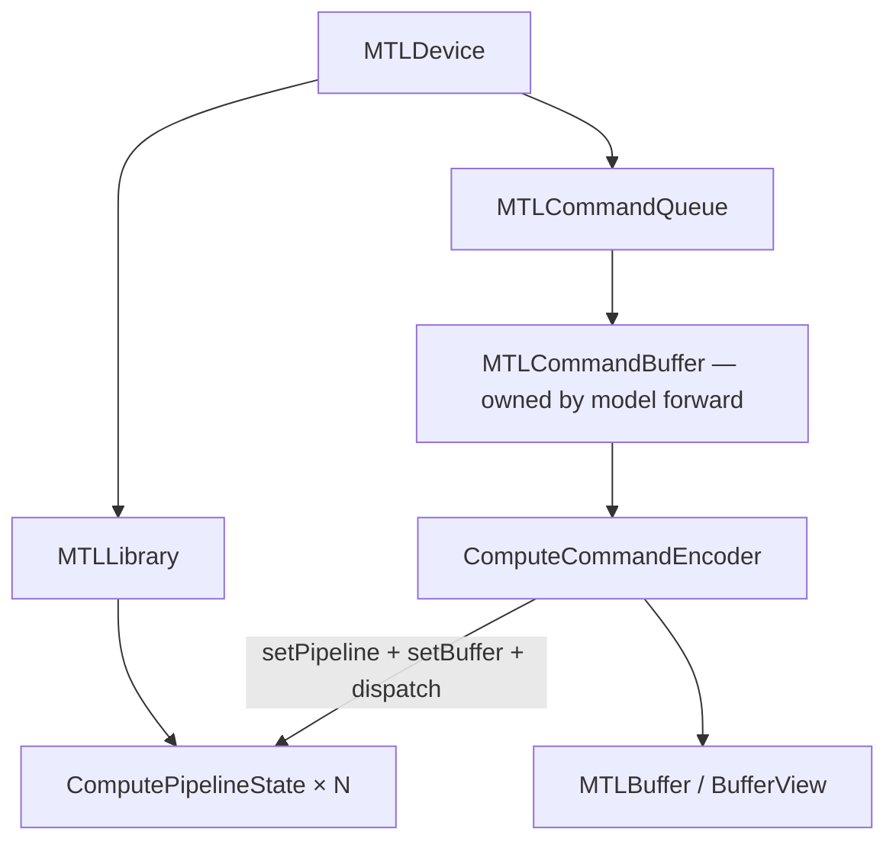

# 04 — Metal Runtime (`MetalContext`)

`MetalContext` is the device layer: one Apple GPU, one command queue, ~150
precompiled pipelines, and hundreds of `encode_*` helpers that bind buffers
and dispatch threadgroups.

File: `src/gpu.rs`. Shaders: `src/shaders/*.metal`.
Prerequisites: [00c](00c_gpu_and_metal_fundamentals.md).

---

## 1. One-sentence summary

Host code never “calls a Metal kernel” directly — it **encodes** a dispatch
into an open compute encoder; the GPU runs it later when the command buffer
is committed. `MetalContext` holds the compiled pipelines so each encode is
just pointer binds + `dispatch_*`.

---

## 2. Objects and ownership



| Concept | Role in this engine |
|---------|---------------------|
| Pipeline state | One compiled entry (`matvec_ggml_q4_0`, `attention_flash_decode_…`) |
| Command buffer | Ordered GPU work for (usually) one decode token or one prefill chunk |
| Encoder | Recording API into the CB |
| BufferView | `{buffer, offset, length, format}` into weights/scratch/KV |

**Ownership split (easy to get wrong):**

- `gpu.rs`: pipelines + encode helpers; **never** creates the CB for the hot path
- `gemma4_gpu_model.rs` / `decode_fused.rs`: create encoder, call encode_*, commit, wait

---

## 3. Startup: compile everything you need

`MetalContext::new` (~line 701):

1. Read/concat Metal sources into one string
2. `device.new_library_with_source`
3. Closure `get_fn(name)` → `library.get_function` →
   `new_compute_pipeline_state_with_function` (panic on missing name)
4. Store each PSO in a named struct field
5. Resolve env policy once (`decode_matvec_kernel`, `use_flash_attention`, …)

**Eager vs lazy:** decode kernels compile at init. Prefill `mul_mm_*` uses
`OnceLock` + a separate library so chat-only loads skip that compile cost.

**Function constants:** flash_attn_ext builds `[safe, aligned]` pairs via
`FunctionConstantValues` (`has_kvpad`, `bc_mask`). Host picks index by shape.

**Head-dim specialization:** separate PSO fields for h128/h256/h512; tiny
`_pipeline_for(head_dim)` match helpers select at encode time.

---

## 4. The encode helper pattern

Naming conventions (teach yourself to read `gpu.rs` by suffix):

| Suffix | Meaning |
|--------|---------|
| `_view` | Takes `&BufferView` (preferred) |
| `_at` / `_at_view` | Explicit byte offsets into shared scratch |
| `_batch` | Prefill / multi-row |
| `_dual` | Two matvecs, one activation load (gate+up) |
| `_gelu` / `_gelu_mul` | Fused activation epilogue |
| `_fused_*` / `_full_fused_*` | Attention fusion depth ladder |
| `_ggml` | Ported llama.cpp geometry / algorithm |

### 4.1 Worked encode: ggml Q4_0 matvec

When `encode_matvec_ggml_at` (or the view wrapper) runs for decode:

```text
1. Build GgmlMulMvArgs { ne00=K, ne01=M, ne10=K, ne0=M, ne1=1, nr0=4, … }
   — field layout MUST match ggml_mul_mv_args in the .metal file byte-for-byte
2. encoder.set_compute_pipeline_state(&self.matvec_ggml_q4_0_pipeline)
3. set_buffer(0, W); set_buffer(1, x); set_buffer(2, y); set_bytes(3, args)
4. threads_per_tg = (64, 1, 1)    # NSG=2 × 32
   tg_count_x     = ceil(M / 8)   # 8 rows per TG
   dispatch_thread_groups
```

If `args` struct drifts from the Metal `struct` (extra field, wrong
padding), you get silent wrong math — the single most fragile host↔shader
boundary in the repo (`ggml_gemv.rs` comments say so).

### 4.2 Worked encode: full fused attention

`encode_attention_full_fused_q4_0` binds ~20+ buffers (Q, norms, cos/sin,
K, V, caches, out, scalars…). Host picks PSO via
`attention_*_pipeline_for(head_dim)` → `h128`/`h256`/`h512`.

Grid: typically **one threadgroup per query head** (or per KV head for GQA
variants), `FLASH_TG_SIZE=256` threads each.

When reading the Metal `kernel void attention_flash_decode_full_fused_*`,
match `[[buffer(i)]]` order to the `set_buffer(i, …)` calls — that is the
fastest way to debug a wrong bind.

Grid math is part of **correctness**. Wrong TG count ⇒ silence or garbage.

---


## 4.3 The args-struct contract (the most fragile line in the repo)

Section 4.1 said the `args` struct must match "byte-for-byte." That deserves
more than a warning, because it is the one boundary in this codebase where being
wrong produces *no error at all*.

Both sides of the contract, side by side:

```9:29:src/ggml_gemv.rs
pub struct GgmlMulMvArgs {
    pub ne00: i32,
    pub ne01: i32,
    pub ne02: i32,
    pub nb00: u64,
    pub nb01: u64,
    pub nb02: u64,
    pub nb03: u64,
    pub ne10: i32,
    pub ne11: i32,
    pub ne12: i32,
    pub nb10: u64,
    pub nb11: u64,
    pub nb12: u64,
    pub nb13: u64,
    pub ne0: i32,
    pub ne1: i32,
    pub nr0: i32,
    pub r2: i16,
    pub r3: i16,
}
```

```11:31:src/shaders/ggml_mul_mv_q4.metal
struct ggml_mul_mv_args {
    int32_t ne00;
    int32_t ne01;
    int32_t ne02;
    uint64_t nb00;
    uint64_t nb01;
    uint64_t nb02;
    uint64_t nb03;
    int32_t ne10;
    int32_t ne11;
    int32_t ne12;
    uint64_t nb10;
    uint64_t nb11;
    uint64_t nb12;
    uint64_t nb13;
    int32_t ne0;
    int32_t ne1;
    int32_t nr0;
    int16_t r2;
    int16_t r3;
};
```

Read the naming convention once and you can read all of ggml's ported kernels:
`neXY` is the **number of elements** along dimension `Y` of tensor `X` (0 =
weights, 1 = activations, no digit = destination); `nbXY` is the **byte stride**
along that dimension. So `ne00 = K` (row length of the weight matrix),
`ne01 = M` (number of rows), `nb01` = bytes per weight row — which for Q4_0 is
`K/32 × 18`, not `K × 4`. The kernel does its own address arithmetic from these,
which is exactly why they must be right.

### Why this fails silently

`set_bytes(3, size_of::<GgmlMulMvArgs>(), ptr)` copies raw bytes into the
kernel's argument buffer. Metal does not know the struct's field names, only its
length. So:

| Mistake | What Metal does | What you see |
|---|---|---|
| Reorder two fields | reads them in the declared order anyway | wrong shapes → garbage or zeros |
| Change `i32` → `u32` | same 4 bytes, different interpretation | usually fine, until a value is negative |
| `u64` → `usize` on a 32-bit target | struct shrinks | every field after it shifts |
| Add a field on one side only | struct lengths differ | tail garbage, or an out-of-bounds read |
| Forget `#[repr(C)]` | Rust may reorder fields for packing | works today, breaks after an unrelated edit |

The last one is the nastiest. Rust's default representation gives the compiler
permission to reorder; the layout you get is stable in practice but not
guaranteed, so the bug can appear on a compiler upgrade with no source change.
`#[repr(C)]` on every struct that crosses into a shader is not a style
preference, it is the contract.

Also note the trailing `i16 r2, r3`. Two 2-byte fields after three 4-byte ones
put the struct's size at a multiple of 4 but *not* of 8. Both sides agree
because both declare the same tail — but if you ever append a `u64` you must
append it on both sides in the same position, or C alignment rules will insert
padding on one side and not the other.

### How to verify, in about a minute

1. `assert_eq!(size_of::<GgmlMulMvArgs>(), N)` in a Rust test, with `N` from the
   Metal side computed by hand. Cheap, and it catches every length change.
2. Have the kernel write `args.ne00`, `args.ne01`, `args.nb01` into the output
   buffer instead of computing anything. Read them back on the host. If they do
   not match what you set, stop — nothing downstream can be trusted.
3. When adding a field, edit both declarations in the same commit and re-read
   them adjacently, as printed above. The comments on both structs
   (`// Must match ggml_mul_mv_ext_args in ggml_gemv.rs`) exist to make that
   pairing findable with `rg`.

The general principle, which applies to every `set_bytes` in `gpu.rs`: **a
buffer binding is type-checked by nobody.** Buffer indices, struct layouts, and
element formats are all conventions maintained by hand, and the compiler will
not help you. That is the tax for hand-written kernels, and it is why Ch 15's
first rule is to verify correctness before believing a speedup.

---

## 5. Lifetime of one decode token (device view)

```text
// gemma4_gpu_model::forward_single_token_inner (simplified)
cmd = queue.new_command_buffer()
enc = cmd.new_compute_command_encoder()
  encode_rope_fill_decode(...)
  encode_ple_prepass(...)
  for layer in 0..n_layers:
      encode_fused_decode_layer(...)   # or legacy per-op ladder
  encode_final_norm + lm_head / sample
enc.end_encoding()
cmd.commit()
cmd.wait_until_completed()
read token or logits; kv_seq_len += 1
```

**`METAL_N_CB`:** default 2 (clamp 1..8). Splits the layer loop across CBs for
CPU/GPU overlap. Forced to 1 when fused decode is active.

Dispatch overhead (~µs × hundreds of kernels) is measurable (~2.4 ms/token in
AGENTS #1) but **not** the growing gap vs llama.cpp at long context — that
gap tracks attention scaling.

---

## 6. Shader inventory (where to open the file)

| File | Responsibility |
|------|----------------|
| `llama.metal` | Norms, RoPE, KV append, fused flash decode, GeLU, sample, legacy attn |
| `ggml_mul_mv_q4.metal` | Q4_0/Q3_0/Q4_K/Q6_K GEMV + ext batch-2..8 |
| `ggml_mul_mm_q4.metal` | Prefill mul_mm (simdgroup MMA) |
| `ggml_flash_attn.metal` | Decode MWG vec FA + reduce |
| `ggml_flash_attn_ext.metal` | Prefill tiled FA + pad/mask helpers |
| `decode_mega.metal` | Optional mega-kernel interpreter (one TG) |

---

## 7. Policy flags living on / near `MetalContext`

Parsed once (or cheaply) from env. Critical attention cluster:

```text
ATTENTION_KERNEL=
  specialized  (default)  — fused flash family
  ggml                    — always ggml MWG decode
  auto                    — fused if kv_seq < 128 else ggml MWG
  generic

FLASH_ATTN=0|legacy       — disable flash family
PREFILL_FLASH_ATTN=0      — legacy causal prefill
ATTENTION_GQA_Q4=1        — opt-in GQA tiled (historically unsafe as default)
FUSED_Q_ATTN / FUSED_K_ATTN / FUSED_KV_ATTN — fusion ladder depth
FUSED_DECODE=0            — disable decode_fused executor
MATVEC_KERNEL=auto|ggml|fast|… — decode GEMV variant
LLAMA_KV_CACHE_TYPE=f16|q8_0|q4_0
METAL_N_CB=1..8
```

Hybrid predicates (memorize — Ch 07 expands):

```216:251:src/gpu.rs
fn attention_kernel_mode() -> AttentionKernelMode { /* env → enum; default Specialized */ }

pub fn attention_use_ggml_for_layer_kv(has_kv: bool, kv_seq: u32) -> bool {
    // Ggml → true; Specialized/Generic → false; Auto → kv_seq >= 128
}

pub fn needs_explicit_kv_append(has_kv: bool, effective_kv_seq: u32) -> bool {
    // true when ggml path active OR fused KV append disabled
}
```

**Default is `Specialized`, not `auto`.** AGENTS.md “best config” means
tuned env, not stock binary defaults.

---

## 8. Attention encode ladder (device API surface)

Host selection eventually calls one of (names approximate; see `gpu.rs`):

| Encode helper | Fuses |
|---------------|-------|
| `encode_attention_full_fused_q4_0` | QK-norm+RoPE+attn+KV append |
| `encode_attention_fused_qknorm_rope_q4_0` | QK-norm+RoPE+attn |
| `encode_attention_qknorm_rope_q4_0` | Q-side fusion only |
| `encode_attention_ggml_q4_0` | MWG main + **reduce** (2 dispatches) |
| `encode_attention_fused_q4_0` | attn + append |
| `encode_prefill_flash_attn_ext_q4_0` | tiled prefill FA |

Full fused can take ~22 buffer arguments. When reading the Metal entry,
match `[[buffer(i)]]` to the encode site set_buffer calls in order.

---

## 9. Profiling hooks

`PROFILE_GPU`, `PROFILE_DISPATCHES`, `PROFILE_ABLATE` / skip flags
(`skip_attn`, `skip_mlp`, …) implement phase timing used in AGENTS E16/E22.
Mental model: ablation zeros a phase’s encodes but keeps the CB structure —
Δms ≈ that phase’s cost (plus second-order effects).

---

## 10. Study path through code

1. Skim `MetalContext` struct fields (~526) — count pipeline families.
2. Read `new()` library concat + `get_fn` (~701–780).
3. Pick one encode you care about (`encode_matvec_ggml_at` or
   `encode_attention_full_fused_q4_0`) and match buffers to the `.metal`
   signature.
4. Grep `new_command_buffer` in `gemma4_gpu_model.rs` — see wait points.

---

## 11 — Tutorial: add a kernel end to end

Nothing makes this layer concrete like adding one. We will add a `vec_clamp`
kernel — `out[i] = clamp(x[i], lo, hi)` — because the math is trivial and the
plumbing is the whole point. Every step below is the same step you would take
for a real kernel.

### Step 1 — Write the Metal entry point

In `src/shaders/llama.metal`, near the other elementwise kernels
(`gelu_mul` ~2696 is a good model):

```metal
kernel void vec_clamp(
    device const float* x   [[buffer(0)]],
    device float*       out [[buffer(1)]],
    constant uint&      n   [[buffer(2)]],
    constant float&     lo  [[buffer(3)]],
    constant float&     hi  [[buffer(4)]],
    uint gid [[thread_position_in_grid]]
) {
    if (gid >= n) return;
    out[gid] = min(max(x[gid], lo), hi);
}
```

Three conventions to copy exactly:

- **`[[buffer(i)]]` indices are the contract** with the host. They must match
  your `set_buffer` / `set_bytes` indices, in order, with no gaps.
- **`constant T&` for scalars, `device T*` for arrays.** Scalars go through
  `set_bytes`; arrays through `set_buffer`.
- **The bounds guard.** `dispatch_threads` rounds the grid up to a multiple of
  the threadgroup size, so threads past `n` *will* run. Without the guard you
  write out of bounds. This is the single most common new-kernel bug.

### Step 2 — Add a pipeline field

In `MetalContext` (`src/gpu.rs`, struct around line 526):

```rust
pub vec_clamp_pipeline: ComputePipelineState,
```

### Step 3 — Compile it at init

In `MetalContext::new` (~701), alongside the other `get_fn` calls:

```rust
let vec_clamp_pipeline = get_fn("vec_clamp");
```

`get_fn` panics if the name is missing. That is deliberate: a typo'd kernel
name should fail at startup, loudly, not silently skip work at token 400.

### Step 4 — Write the encode helper

```rust
pub fn encode_vec_clamp(
    &self,
    encoder: &ComputeCommandEncoderRef,
    x: &Buffer,
    out: &Buffer,
    n: u32,
    lo: f32,
    hi: f32,
) {
    encoder.set_compute_pipeline_state(&self.vec_clamp_pipeline);
    encoder.set_buffer(0, Some(x), 0);
    encoder.set_buffer(1, Some(out), 0);
    encoder.set_bytes(2, 4, &n as *const u32 as *const _);
    encoder.set_bytes(3, 4, &lo as *const f32 as *const _);
    encoder.set_bytes(4, 4, &hi as *const f32 as *const _);

    let tg = 256u64;
    encoder.dispatch_threads(
        MTLSize { width: n as u64, height: 1, depth: 1 },   // total threads
        MTLSize { width: tg,       height: 1, depth: 1 },   // per threadgroup
    );
}
```

Note the choice of `dispatch_threads` (total thread count) over
`dispatch_thread_groups` (group count). For a flat elementwise map, threads is
the natural unit and Metal does the rounding. For anything where a threadgroup
*owns* a unit of work — a row, a head, a token — use `dispatch_thread_groups`
and compute the count yourself, because then the count is part of the
algorithm, not a rounding detail. Ch 00c Part D.

### Step 5 — Add a `_view` variant if it will be called on scratch

The hot paths pass `BufferView`s, not raw buffers, because weights and scratch
are suballocated:

```rust
pub fn encode_vec_clamp_view(
    &self, encoder: &ComputeCommandEncoderRef,
    x: &BufferView, out: &BufferView, n: u32, lo: f32, hi: f32,
) {
    encoder.set_compute_pipeline_state(&self.vec_clamp_pipeline);
    encoder.set_buffer(0, Some(x.buffer), x.offset);
    encoder.set_buffer(1, Some(out.buffer), out.offset);
    // ... scalars as above
}
```

The offset goes in the `set_buffer` call, so the kernel still indexes from 0.
This is why so many helpers exist in `_view` / `_at` / `_at_view` flavors —
same kernel, different addressing.

### Step 6 — Call it from a forward path

In `decode_fused.rs` or `gemma4_gpu_model.rs`, inside an open encoder:

```rust
self.ctx.encode_vec_clamp(encoder, &scratch.hidden, &scratch.hidden, hidden_size as u32, -10.0, 10.0);
n += 1;   // keep the dispatch counter honest for PROFILE_DISPATCHES
```

Note in-place is fine here (`x` and `out` the same buffer) because each thread
reads and writes only its own index. It would **not** be fine for a kernel
where threads read neighbors — then you need separate buffers or a barrier.

### Step 7 — Gate it behind an env var if it changes behavior

```rust
if gpu::vec_clamp_enabled() { /* encode */ }
```

Every optimization in this repo is runtime-switchable for the reasons in
Ch 15. A change you cannot A/B is a change you cannot defend.

---

## 12 — Debugging the host↔shader boundary

The four failures you will actually hit, and how each announces itself:

| Symptom | Cause | How to confirm |
|---|---|---|
| Panic at startup, "function not found" | Kernel name typo, or file not concatenated into the library source | Grep the name in both `gpu.rs` and the `.metal` file |
| Output is all zeros | Buffer bound at the wrong index, or `n` passed as 0 | Print every `set_*` index next to the `[[buffer(i)]]` list |
| Output is garbage but structured (periodic, or right at the start then wrong) | Grid math wrong: too few threadgroups, or stride/offset mismatch | Compute expected TG count by hand; check what fraction of output is correct |
| Output is subtly wrong, no crash | An args-struct field mismatch, or wrong dtype interpretation | Compare the Rust struct to the Metal `struct` field by field, including padding |

That last row is the dangerous one. `GgmlMulMvArgs` and friends must match the
Metal `struct` **byte for byte** — Rust and Metal must agree on field order,
size, and padding. The comments in `ggml_gemv.rs` say so explicitly, and it is
the most fragile boundary in the repo. Add a field in one place only and you
get plausible-looking wrong numbers with no diagnostic.

A practical habit when a kernel misbehaves: **read the Metal signature and the
encode site side by side, top to bottom, out loud.** `[[buffer(0)]]` — is
`set_buffer(0, ...)` the same tensor? `[[buffer(3)]]` — is that `set_bytes(3,
...)` with the right size? Nine times out of ten the bug is visible in 30
seconds this way, and invisible for an hour any other way.

---

## 13 — Exercises

1. Add `vec_clamp` for real, wire it into the decode path behind an env var,
   and confirm with `PROFILE_DISPATCHES=1` that the count went up by exactly
   one per token.

2. Delete the `if (gid >= n) return;` guard and run with `n = 100`. Explain
   what memory gets written and why the corruption location depends on the
   threadgroup size.

3. Swap `set_buffer(0, ...)` and `set_buffer(1, ...)` in your helper. Predict
   the output before running, then run it.

4. Convert your helper from `dispatch_threads` to `dispatch_thread_groups`.
   What TG count do you pass? What happens when `n = 257` and `tg = 256`?

5. Take `encode_attention_full_fused_q4_0` and its Metal entry point. List
   every `[[buffer(i)]]` alongside the matching `set_buffer`/`set_bytes` call.
   How many are buffers, how many are scalars?

6. Why are `mul_mm` pipelines behind `OnceLock` while decode pipelines compile
   eagerly? Whose startup time does that protect?

7. `METAL_N_CB=2` splits the layer loop across two command buffers, but is
   forced to 1 when fused decode is active. Give the reason, in terms of what
   the fused executor does with its encoder.

---

## Checklist

- [ ] I can name who creates/commits/waits on a command buffer, and who only encodes.
- [ ] I can add a kernel end to end without looking at this chapter.
- [ ] I know why the `gid >= n` guard is mandatory with `dispatch_threads`.
- [ ] I know when to use `dispatch_threads` vs `dispatch_thread_groups`.
- [ ] I know what `BufferView.format` prevents.
- [ ] I know the default `ATTENTION_KERNEL` mode and that it is not `auto`.
- [ ] I know why `mul_mm` pipelines are lazy.
- [ ] I can diagnose the four host↔shader failure modes from their symptoms.

**Next:** [05_quantization_matmul.md](05_quantization_matmul.md)
