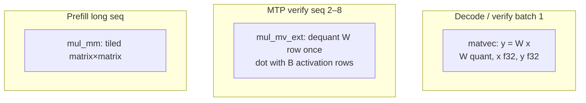

# 05 — Quantization & Matmul

## One-sentence summary

Weights live in **ggml block-quant formats**; activations stay **f32** (sometimes
f16 for prefill RHS); Metal kernels **dequantize on the fly** inside matvec /
matmul — the GPU never materializes a full f32 weight matrix.

---

## Why quantize

| Format | Bytes / weight (approx) | Role |
|--------|-------------------------|------|
| bf16/f16 | 2 | Reference / sensitive tensors |
| Q8_0 | ~1.0625 | KV or weights |
| Q4_0 | 0.5625 (18 B / 32) | Classic ggml |
| Q4_K / Q6_K | mixed (K-quants) | GGUF Q4_K_M everyday |

Bandwidth-bound matvecs on Apple Silicon: fewer bytes from memory ⇒ more tok/s,
until quality or dequant overhead wins.

---

## Q4_0 block (teaching format)

```text
32 weights → 18 bytes
┌──────────┬────────────────────────────┐
│ f16 d    │ 16 bytes qs (2×4-bit/byte) │
│ 2 bytes  │                            │
└──────────┴────────────────────────────┘

value = (nibble - 8) * d
```

Row of K columns: `(K/32) * 18` bytes stride.

K-quants (Q4_K, Q6_K) use larger super-blocks with multiple scales — kernels in
`ggml_mul_mv_q4.metal` / `ggml_mul_mm_q4.metal` know the layouts.

---

## Three matmul regimes



| Regime | Host encode | Shader family | When |
|--------|-------------|---------------|------|
| Matvec | `encode_matvec_*` | `llama.metal` / ggml mv | Decode token |
| Ext | `encode_prefill_kquant…` ext | `matvec_ggml_ext_q*K_nx8_r{2..5}` | Small batch 2–8 |
| Mul_mm | `encode_mul_mm_*` | `mul_mm_q4_K_*` etc. | Prefill when seq large enough |

**Trap (`AGENTS.md` M2):** forcing `mul_mm` at tiny seq can be **slower** than
ext matvec. Thresholds matter (`MUL_MM_MIN_SEQ`).

---

## Matvec geometry (intuition)

Threadgroups cooperate on output rows. Tile height (`KQ_NR0`-style knobs)
trades occupancy vs memory traffic. Experiment 3 in `AGENTS.md`: `KQ_NR0=2`
was slower than 4 on M1 Pro — bandwidth-bound, not “more tiles always better.”

Fused variants:

- Dual gate∥up in one dispatch
- RMSNorm + QKV
- Gate∥up + GeLU (+ down) mega fusions
- Ext + GeLU for verify (`PREFILL_GATE_UP_EXT_GELU`)

Fusion saves **dispatches and intermediate bytes**; weight traffic often
unchanged → small e2e wins (M7 ~noise).

---

## Prefill f16 activations

`PREFILL_MLP_F16=1`: cast activations to f16 for `mul_mm` RHS to cut bandwidth.
Separate from weight quant. PLE projections wrongly forced through Q4 path
were a major prefill regression until kept f16 (`AGENTS.md` E22).

---

## LM head

Vocab-sized matvec (`~262k × hidden`). Server verify MTP historically called
this **per row**; batched lm_head over verify rows was a real +tok/s win (M3).

---

## Correctness mindset

Quant kernels must match ggml numerics closely enough for greedy tokens to
agree with llama.cpp on short prompts. When debugging garbage:

1. Is it quant? (compare f16 path / single layer)
2. Is it KV append / shared layer / attention mode?
3. Is it chat template / sampling?

---

## Checklist

- [ ] Draw a Q4_0 block and reconstruct one weight.
- [ ] Distinguish matvec vs ext vs mul_mm and when each wins.
- [ ] Explain why fusion ≠ free performance.
- [ ] Name the PLE f16 prefill lesson.

**Next:** [06_kv_cache.md](06_kv_cache.md)
