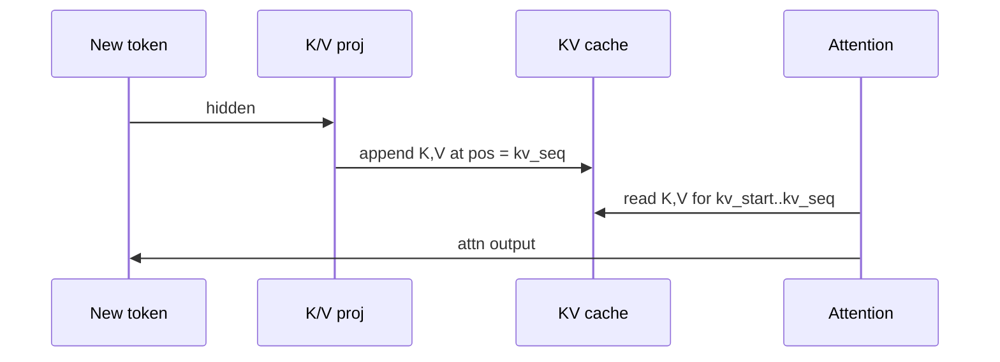

# 06 — KV Cache

## One-sentence summary

For each layer that owns KV, the engine stores **rotated** keys and values in
two separate Metal buffers with layout **(kv_head, token, row)**, where `row`
is `head_dim` elements (f16) or packed Q8_0/Q4_0 groups — written once per
token (append) and **fully re-read** on every decode attention.

---

## Why KV exists

Naïve transformers recompute K,V for all past tokens every step → O(n²) matmuls.
Caching K,V makes decode attention O(n) in sequence length (still heavy), with
constant cost for projecting the **new** token’s K,V.



---

## Layout (head-major)

```text
buffer[layer]:
  for h in 0..num_kv_heads:
    for t in 0..capacity:
      row[t]  # head_dim f16 elems OR quant row_bytes
```

Offset (f16):

```text
off = h * capacity * head_dim + t * head_dim + d
```

Q8_0 / Q4_0 use the same head/token nesting with `row_bytes` instead of
`head_dim` elements:

```text
off = h * capacity * row_bytes + t * row_bytes + group_offset
```

K and V are **separate** buffers (`k_cache[layer]`, `v_cache[layer]`).

`head_dim` depends on layer type (128 sliding vs 512 full) ⇒ different
`bytes_per_row` per layer at allocation time (`KvCachePool::new`).

Dimension order fastest→slowest: **dim → token → kv_head**.

---

## Cache dtypes (`KvCacheType`)

| Type | `bytes_per_row(hd)` | Env |
|------|---------------------|-----|
| F16 | `hd * 2` | default |
| Q8_0 | `(hd/32)*34` | `LLAMA_KV_CACHE_TYPE=q8_0` |
| Q4_0 | `(hd/32)*18` | `q4_0` (recommended in README) |

Attention kernels must match dtype (`attention_*_q4_0` vs `_f16`).

---

## Append paths

| Path | Mechanism |
|------|-----------|
| Explicit | `encode_kv_append_{f16,q8_0,q4_0}` after K/V ready |
| Fused | Flash decode kernel writes new row after attending |
| Prefill batch | `kv_cache_batch_append_*` for many positions |

**Hybrid auto hazard:** when attention switches to ggml MWG, append is **not**
inside the FA kernel → must call explicit append (`needs_explicit_kv_append`).

---

## Sliding window reads

For sliding layers, attention uses `kv_start = max(0, kv_seq - window)` but
still **appends** at absolute `kv_seq`. Cache is flat; window only limits reads.

---

## Shared-KV layers

```text
has_kv == false  ⇒  no K/V proj, no append
attention reads k_cache[kv_source_layer], v_cache[kv_source_layer]
row_bytes / head_dim must match the source layer
```

Anchor selection should match llama.cpp semantics for Gemma4
(`n_layer_kv_from_start` style) — see `AGENTS.md` #12.

---

## Model-owned vs pool slots

| Mode | Storage |
|------|---------|
| CLI / benches | `Gemma4GpuModel`’s own `k_cache`/`v_cache` |
| Server | `KvCachePool` with `N` slots; model aliases slot buffers per forward |
| MTP verify | `KvCachePool::from_existing` aliases live buffers (no copy) |

Ch 13 covers pool API.

---

## Bandwidth picture

One decode step for one layer / one KV head:

```text
bytes ≈ kv_span * row_bytes   # K
      + kv_span * row_bytes   # V
```

× layers that attend × heads (or shared via GQA TG). As `kv_seq` grows, attention
dominates — matches measured tok/s decay (`AGENTS.md`, long-ctx notes).

---

## Checklist

- [ ] Write the f16 offset formula from memory.
- [ ] Explain append vs read for sliding window.
- [ ] Shared layer invariants.
- [ ] Why `auto` needs explicit append after 128 tokens.

**Next:** [07_attention.md](07_attention.md)
