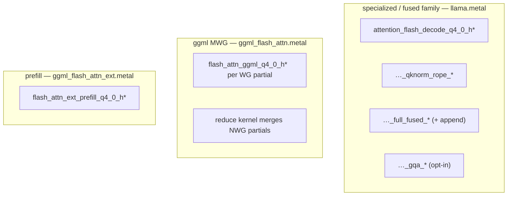

# 07 — Attention Kernels

## One-sentence summary

Decode attention is a family of Metal kernels that, for each query head (or KV
head in GQA mode), stream K/V from the cache, maintain online softmax
statistics, and accumulate a weighted V — with optional fusion of QK-norm,
RoPE, and KV append; a parallel **ggml MWG** path trades short-context speed
for flatter long-context scaling; **`ATTENTION_KERNEL=auto`** switches at 128.

---

## What attention computes (decode, one head)

```text
For positions t in [kv_start, kv_seq):
  score_t = scale * dot(Q_h, K_h(t))     # (+ mask / softcap variants)
softmax → α_t
out = Σ α_t * V_h(t)
```

Flash / online softmax: process K/V in tiles, keep running `m` (max) and `l`
(sum of exps) so you never materialize a full `kv_seq` score vector in DRAM.

---

## Kernel families



| Family | Strength | Weakness |
|--------|----------|----------|
| Fused flash decode | Best short ctx (~25 tok gen) | Degrades more as ctx grows |
| ggml MWG | Flatter ~49 tok/s across ctx | Loses short-ctx peak |
| auto hybrid | Near fused short + better long | Must fix KV append semantics |
| GQA tiled | Fewer KV loads | Correctness regressions historically — opt-in |

---

## Host selection (`gpu.rs`)

```text
ATTENTION_KERNEL=specialized → never ggml
ATTENTION_KERNEL=ggml        → always ggml MWG
ATTENTION_KERNEL=auto        → kv_seq >= 128 → ggml else fused
```

Prefill uses **ext** tiled kernels separately (`PREFILL_FLASH_ATTN`,
`TILED_EXT_MIN_Q` — lowered to 2 for MTP verify batching).

---

## Fused vs decomposed

```text
Decomposed:
  rmsnorm Q,K → rope → (append) → attention_flash

Fused qknorm_rope:
  one kernel loads Q, applies norm+rope, attends

Full fused:
  also appends K/V inside the same kernel after using f32 K/V for this step
```

Splitting fused pieces incorrectly (GQA experiment 11) produced high tok/s
**garbage**. Prefer matching a known-good fused entry point over “more fusion.”

---

## ggml MWG intuition

```text
NWG workgroups partition the KV axis
Each WG: partial O, m, l into temp buffer
Reduce: combine partials → final O
```

Helps when `kv_seq` is large vs `NWG * tile`. At short ctx, launch overhead can
hurt (early NWG=32 experiment was worse). Current ggml path is the tuned port.

Temp buffer sizing bugs (`DV` vs `DV4`) corrupt S/M — see AGENTS #9.

---

## GQA dispatch

**Per Q head:** `threadgroups = num_heads` — simple; may reload same KV.

**Per KV head:** `threadgroups = num_kv_heads`, simdgroups share KV tile —
`num_kv_groups` Q heads cooperate. Bandwidth win when implemented correctly.

---

## Softmax / numerics notes

- Online flash update must use consistent float accumulators.
- Causal mask in prefill: query row `i` only sees keys `≤ i` (+ chunk offsets).
- Sliding: restrict key range; still causal inside window.

---

## Study path through code

1. Find encode site in `decode_fused.rs` / `gemma4_gpu_model.rs` for one layer.
2. Note which PSO name is chosen for your env.
3. Open matching `kernel` in `llama.metal` or `ggml_flash_attn.metal`.
4. Trace: Q load → score → softmax state → V accumulate → store → optional append.

---

## Checklist

- [ ] Online softmax purpose in one sentence.
- [ ] specialized vs ggml vs auto behavior.
- [ ] Why full_fused append differs from ggml path.
- [ ] Prefill ext vs decode flash are different shaders.

**Next:** [08_mlp_norms_ple.md](08_mlp_norms_ple.md)
