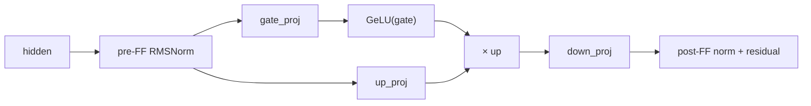
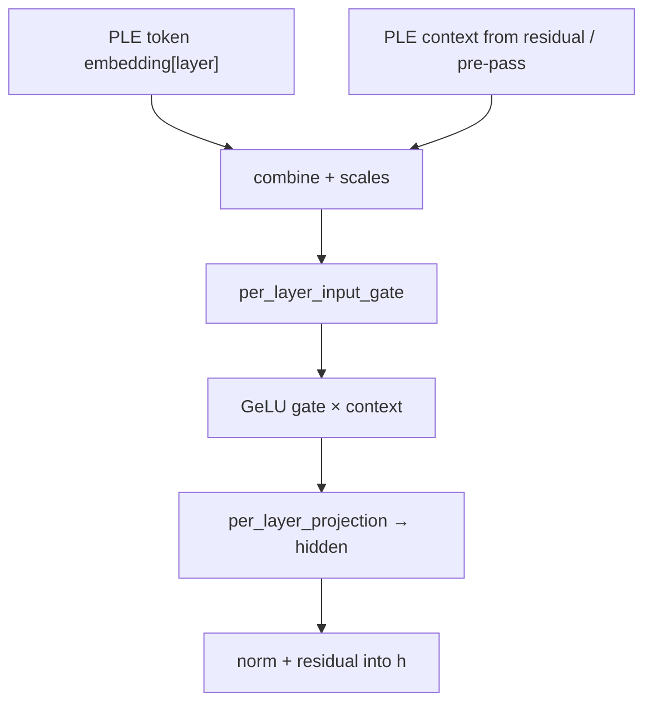

# 08 — Norms, MLP, and PLE

## RMSNorm

```text
rms = sqrt(mean(x²) + eps)
y = (x / rms) * weight
```

Variants in shaders:

| Kernel | Use |
|--------|-----|
| `rmsnorm` | Standard |
| `rmsnorm_per_head` | QK-norm / V-norm style |
| `rmsnorm_acc` | Norm + add into residual |
| fused with matvec | `rmsnorm_qkv_q4_*`, mlp fused packs |

`rms_norm_eps` from config.

---

## MLP block (Gemma4)



Shapes (E4B mental model): `hidden=2560`, `intermediate=10240` (or per-layer
`intermediate_sizes` on E2B).

### Decode implementations

| Style | Idea |
|-------|------|
| Dual matvec | One dispatch computes gate and up |
| Separate + `gelu_mul` | Clear; more launches |
| Fused rmsnorm→gelu→down | Max fusion (`FUSED_MLP_*`) |
| ggml / gelu f16 toggles | Lab knobs in `AGENTS.md` E20 |

### Prefill implementations

| Style | Idea |
|-------|------|
| Stacked gate∥up `mul_mm` | Better arithmetic intensity |
| f16 RHS | `PREFILL_MLP_F16` |
| Ext GeLU for seq 2–8 | MTP verify (`PREFILL_GATE_UP_EXT_GELU`) |

MLP is often **~half of prefill time** (E16 phase timing). Optimizing attention
alone will not fix a prefill gap.

---

## Residuals

Pattern via `encode_proj_norm_residual`:

```text
h = h + Norm(projection_out)     # post-norm style path used in Gemma4 engine
```

Exact ordering must match the reference model; “pre-norm vs post-norm” mistakes
cause subtle quality loss rather than crashes.

---

## PLE block (per layer)



There is often a **global PLE pre-pass** once per token (project hidden into
per-layer context slots) plus **per-layer** gate/proj.

### Performance lesson

PLE `inp_gate` / `proj` tensors may be **F32 in GGUF** even when the rest is
Q4_K_M. Requantizing them to Q4_0 and running `projection_q4_batch` was a major
prefill bottleneck; keeping dense f16 + `mul_mm_f16` recovered hundreds of ms
(`AGENTS.md` E22).

---

## Layer scalar

Final per-layer `encode_vec_scale(hidden, layer_scalar)` dampens depth.

---

## Final norm + lm_head

```text
h = RMSNorm(h, final_norm)
logits = lm_head @ h          # huge Q4/K matvec
# softcap on logits when required
```

`DecodeMode::Advance` may skip logits (KV advance only). Scheduler needs logits.

---

## Checklist

- [ ] Write RMSNorm formula.
- [ ] Draw gate/up/GeLU/down dataflow.
- [ ] Say why PLE dtype bit you.
- [ ] Know which phase (prefill vs decode) MLP dominates.

**Next:** [09_decode_path.md](09_decode_path.md)
