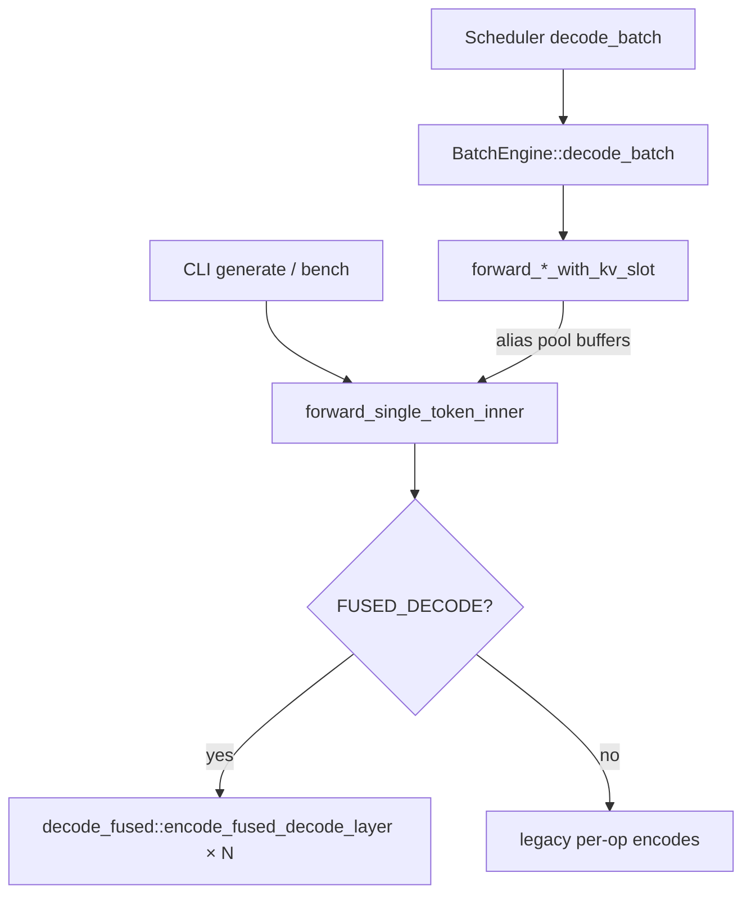

# 09 — Decode Path (One Token → Next)

## Entry points



Primary file: `gemma4_gpu_model.rs` (`forward_single_token_inner`).  
Fused executor: `decode_fused.rs`. Open those — do not use archived notes.

---

## Phases inside `forward_single_token_inner`

1. **CPU embed + PLE token rows** → write GPU buffers  
2. **New command buffer + encoder**  
3. **RoPE table fill** for current position  
4. **Optional PLE pre-pass**  
5. **For each layer:** attention → MLP → PLE → layer_scalar  
6. **Final norm + lm_head** (unless Advance)  
7. **Commit + wait**  
8. **Readback** sample or logits; bump `kv_seq_len` / `total_tokens`

### Condensed call graph

```text
forward_single_token_inner(token, mode)
├── embed_tables.decode_embed_into → write hidden_buf
├── decode_ple_into → write ple token buf
├── cmd + encoder
├── encode_rope_fill_decode
├── [optional PLE pre-pass: proj / scale / rmsnorm_per_head / add]
├── for layer in 0..num_layers:
│   ├── attn:
│   │   ├── rmsnorm (+ optional fused QKV matvecs)
│   │   ├── QK-norm + RoPE          # skipped if inside fused attn
│   │   ├── needs_explicit_kv_append? → encode_kv_append_*
│   │   ├── attention_full_fused_* | qknorm_rope_* | ggml MWG | …
│   │   │     (shared KV: read kv_source_layer; skip K/V proj+append)
│   │   └── O proj → post-attn norm + residual
│   ├── mlp: rmsnorm → gate∥up → GeLU → down → residual
│   ├── ple: gate → GeLU → proj → residual
│   └── vec_scale(layer_scalar)
├── final rmsnorm → lm_head          # unless DecodeMode::Advance
├── [optional encode_sample]
├── commit + wait_until_completed
└── readback + kv_seq_len++
```

CPU↔GPU: embed/PLE rows in; sample (4 B) or full logits out. Server uses logits
+ `sampling.rs`.

---

## Per-layer attention choice tree (conceptual)

```text
if needs_explicit_kv_append: encode_kv_append*
if attention_use_ggml(...):
    encode ggml MWG (+ reduce)
else if full_fused available & enabled:
    encode attention_full_fused_*
else if qknorm_rope fused:
    encode attention_qknorm_rope_*
else:
    rmsnorm / rope / attention decomposed
then: O proj → post-attn residual
```

Shared layers: skip K/V proj + append; pass `kv_source_layer` buffers into
attention encode.

---

## Fused decode executor

`decode_fused.rs` builds a cleaner layer encode when `FUSED_DECODE` is on:

- `encode_fused_attn_layer`
- `encode_fused_mlp_layer`
- `encode_fused_ple_layer`

Same math, fewer host-side branches mid-layer. Disabling fusion (`FUSED_DECODE=0`)
was a wash for tok/s (`AGENTS.md` #4) — bottleneck elsewhere.

---

## Mega kernel path

`MEGA_KERNEL=1` → `mega_decode.rs` / `decode_mega.metal` encodes a prebuilt op
graph as fewer (ideally one) dispatches. Treat as experimental alternate; verify
parity before trusting.

---

## Batch decode

`forward_decode_batch_with_kv_slots`: multiple slots each contribute one token.
Host packs batch projections / attention. `BatchEngine` chunks by
`max_decode_batch_size()`. Batch size 1 falls back to single-token path.

---

## Sampling boundary

| Mode | Readback | Sampler |
|------|----------|---------|
| CLI Sample | 4-byte token | GPU `sample_min_p` |
| Server Logits | vocab floats | CPU `sampling.rs` (penalties, top-k, …) |

GPU sample may not apply repetition/frequency penalties — know which path you are on.

---

## Dispatch count intuition

Unfused × 42 layers ⇒ hundreds of kernels / token (`AGENTS.md` ~455). Fusion
collapses many. Overhead ~ms; compute ~tens of ms depending on ctx.

---

## Walkthrough exercise

1. Set `ATTENTION_KERNEL=specialized`, run `--bench-decode` at 25.  
2. Set `ATTENTION_KERNEL=auto`, generate past 128 tokens; confirm coherent text.  
3. Temporarily break append (don’t commit) — observe garbage — restore.  
   (Or re-read AGENTS #15 writeup if you prefer not to break code.)

---

## Checklist

- [ ] Trace CLI vs server into `forward_single_token_inner`.  
- [ ] List what shared-KV layers skip.  
- [ ] Explain logits vs sample readback.  
- [ ] Sketch the attention choice tree including `needs_explicit_kv_append`.

**Next:** [10_prefill_path.md](10_prefill_path.md)
