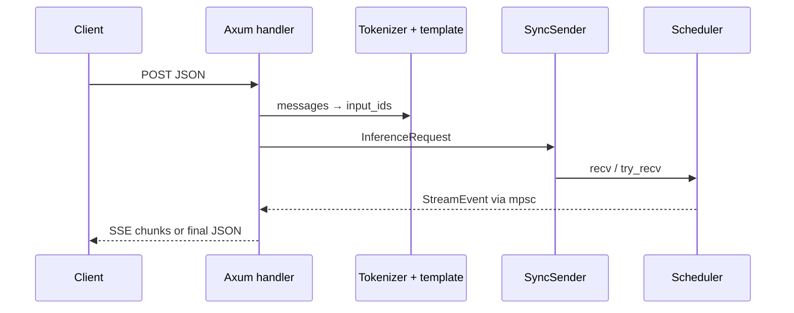

# 11 — Server & OpenAI API

## Role

`src/server.rs` turns HTTP into `InferenceRequest`s and streams
`StreamEvent`s back. It does **not** run Metal itself — that is the scheduler
thread.

---

## Endpoints

| Route | Purpose |
|-------|---------|
| `POST /v1/chat/completions` | Main inference (JSON or SSE) |
| `GET /v1/models` / `/models` | Model card listing |
| `GET /health` | Liveness |
| `GET /metrics` | Prometheus-style metrics |

---

## Startup

```text
main --gpu MODEL --serve [--port N] [--mtp DRAFT]
  → load Gemma4GpuModel
  → ServerRuntimeConfig::from_env()
  → sync_channel(queue_depth)
  → spawn_scheduler (or MtpScheduler)
  → axum serve AppState { request_tx, metrics, tokenizer, ... }
```

---

## Chat completion path



Steps in words:

1. Parse `ChatCompletionRequest` (messages, max_tokens, temperature, stream, …).  
2. `apply_chat_template` + encode.  
3. Build `GenerationParams` (timeouts, eos ids, penalties).  
4. `try_send` on bounded queue — if full, fail fast (backpressure).  
5. If `stream`: write SSE as tokens arrive; else buffer until Done.

---

## Cancellation

`cancel: Arc<AtomicU8>` with `CANCEL_NONE / CLIENT / STOP`. Client drop or stop
sequences flip the flag; scheduler checks between steps and finishes with an
appropriate `finish_reason`.

---

## Runtime config (`ServerRuntimeConfig`)

| Field | Env | Default |
|-------|-----|---------|
| `queue_depth` | `LLAMA_QUEUE_DEPTH` | 32 |
| `kv_pool_slots` | `LLAMA_KV_POOL_SLOTS` | 4 |
| `request_timeout` | `LLAMA_REQUEST_TIMEOUT_SECS` | 300s |
| `max_prefill_tokens_per_tick` | `LLAMA_PREFILL_TOKENS_PER_TICK` | optional |

Exposed again on `/metrics` for ops visibility.

---

## Metrics

`metrics.rs`: counters/gauges for dequeue, prefill/decode latency, batch sizes,
active phases, finish reasons. Use under load to see if you are **queue-bound**,
**slot-bound**, or **compute-bound**.

---

## Tooling / extras

Server file also contains helpers for tool-call markup / channel parsing used by
some chat UIs — treat as product surface, not core GPU curriculum. Skim when
building UI integrations (`ui/chat.py`).

---

## Checklist

- [ ] Name four endpoints.  
- [ ] Explain backpressure via `queue_depth`.  
- [ ] Know scheduler is a different thread from axum.  
- [ ] Softcap/sampling happen after GPU logits on this path.

**Next:** [12_scheduler_batching.md](12_scheduler_batching.md)
