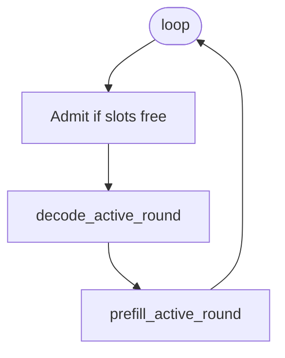

# 12 — Scheduler & Continuous Batching

## One-sentence summary

The scheduler maintains a set of **active** requests each holding a KV slot;
every loop iteration it **admits** new work if slots are free, runs **one decode
forward for all Decoding requests as a batch**, then runs a **budgeted prefill
round** for Prefilling requests — continuous batching without waiting for an
entire batch to finish the prompt.

File: `src/scheduler.rs`.

---

## Main loop

```text
while receiver_open || !active.is_empty():
  if active empty:  blocking recv → admit
  else:             try_admit while slots available

  if active non-empty:
    decode_active_round(active)
    prefill_active_round(active)
```



Decode before prefill favors interactive latency for already-generating users.

---

## ActiveRequest

| Field | Meaning |
|-------|---------|
| `request` | ids, params, response channel, cancel |
| `slot` | `KvSlot` into the pool |
| `phase` | `Prefilling` or `Decoding` |
| `prefill_cursor` | next prompt index |
| `logits` | last forward logits |
| `generated_tokens` / `completion_tokens` | sample history |
| latency accumulators | metrics |

---

## Admit

```text
allocate_slot()?
  else Error kv_pool_full
timeout already elapsed? → Done timeout + release
cancel already set? → Done + release
else push ActiveRequest Prefilling
```

---

## Decode round

1. For each `Decoding` request, `prepare_decode_token` (EOS/max/cancel/timeout checks).  
2. Build `Vec<DecodeInput { slot, token_id }>`.  
3. `engine.decode_batch` → logits per item.  
4. Sample (`sampling.rs`) → send `StreamEvent::Token` or finish.  
5. Remove finished; release slots.

---

## Prefill round

1. `plan_prefill_round` selects Prefilling actives and how many tokens each gets
   this tick (respect `max_prefill_tokens_per_tick` and engine chunk max).  
2. Slice `input_ids[cursor..cursor+n]`.  
3. `want_logits = (cursor+n == len)`.  
4. `prefill_batch` → on complete, sample first token, flip to Decoding.

Fairness via rotating `next_prefill_index`.

---

## Continuous batching picture

```text
Time →
Req A: [==== prefill ====][d][d][d][d]...
Req B:     [== pref ==][d][d][d]...
Req C:           [======== prefill ========][d]...

Same decode_batch may include A,B while C still prefilling.
```

Slots occupied for the whole lifetime of the request (prefill + decode).

---

## Contrasts

| Mode | Scheduler | Concurrency |
|------|-----------|-------------|
| Normal serve | `Scheduler` | Multi-slot CB |
| MTP serve | `MtpScheduler` | **Serial** one sequence (draft/verify needs exclusive model+KV) |

---

## Failure modes to recognize

| Symptom | Likely cause |
|---------|----------------|
| Immediate pool errors | `LLAMA_KV_POOL_SLOTS` too small for concurrency |
| Long queue wait, GPU idle | slots full; increase slots or reduce max_tokens |
| One fat prompt starves others | raise/balance `LLAMA_PREFILL_TOKENS_PER_TICK` |
| Timeouts under load | `LLAMA_REQUEST_TIMEOUT_SECS` or overload |

---

## Checklist

- [ ] Recite the loop order (admit → decode → prefill).  
- [ ] Define continuous batching in one sentence.  
- [ ] Explain `want_logits` on the last prefill chunk.  
- [ ] Why MTP cannot use this scheduler as-is.

**Next:** [13_kv_pool.md](13_kv_pool.md)
