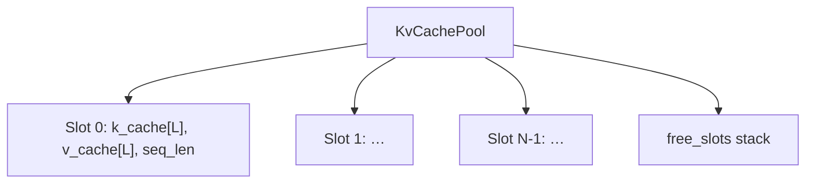

# 13 — KV Pool & BatchEngine

## One-sentence summary

`KvCachePool` pre-allocates **N independent GPU KV caches** (slots); the
scheduler allocates a free slot per request; `BatchEngine` binds those slots to
model forwards so multiple conversations keep separate contexts on one GPU.

Files: `src/kv_pool.rs`, `src/batch_engine.rs`.

---

## Pool structure



Per layer buffer size:

```text
byte_len = num_kv_heads * max_seq_len * bytes_per_row(layer_head_dim)
```

`max_seq_len` comes from `LLAMA_CTX_SIZE` / model `kv_capacity`.  
`N` from `LLAMA_KV_POOL_SLOTS` (default **4**).

---

## API

| Method | Behavior |
|--------|----------|
| `allocate()` | Pop free index; mark in_use; seq_len=0 |
| `release(slot)` | Clear counters; push back to free |
| `reset(slot)` | Zero seq without freeing |
| `seq_len` / `slot_view` | Metadata for encodes |
| `from_existing(...)` | Alias model buffers (MTP verify) |

`KvSlot` is a newtype index. Invalid use → `KvPoolError`.

---

## BatchEngine bridge

```text
BatchEngine {
  model: Gemma4GpuModel,
  kv_pool: KvCachePool,
}
```

| Method | Forwards to |
|--------|-------------|
| `prefill_chunk` / `prefill_batch` | `forward_prefill_*_with_kv_slot(s)` |
| `decode_one` / `decode_batch` | `forward_*_with_kv_slot(s)` |
| `allocate_slot` / `release_slot` | pool |

Model temporarily **aliases** `k_cache`/`v_cache` pointers (or passes views) so
kernels write the correct slot. After forward, slot `seq_len` updates.

---

## Memory math (order-of-magnitude)

```text
pool_bytes ≈ slots * sum_over_layers( 2 * kv_heads * ctx * row_bytes )
```

Q4_0 KV shrinks this vs f16. Raising slots × ctx is the usual OOM / memory
pressure lever — not weight size (weights shared).

---

## Queue vs pool (again)

```text
Queue  = waiting InferenceRequests (CPU structs)     LLAMA_QUEUE_DEPTH
Pool   = live GPU contexts                           LLAMA_KV_POOL_SLOTS

throughput concurrency ≤ pool slots
burst absorption ≤ queue depth
```

---

## MTP aliasing

`from_existing` clones Metal buffer *handles* (refcounted) so verify kernels
append into the **same** physical KV as decode — required for speculative
acceptance. Do not `release` those alias slots as if they were pool-owned in
the normal sense (MTP code paths manage lifetime carefully).

---

## Checklist

- [ ] Draw slots with free list.  
- [ ] Compute why slots dominate memory at long ctx.  
- [ ] Role of BatchEngine in one sentence.  
- [ ] What `from_existing` is for.

**Next:** [14_mtp.md](14_mtp.md)
