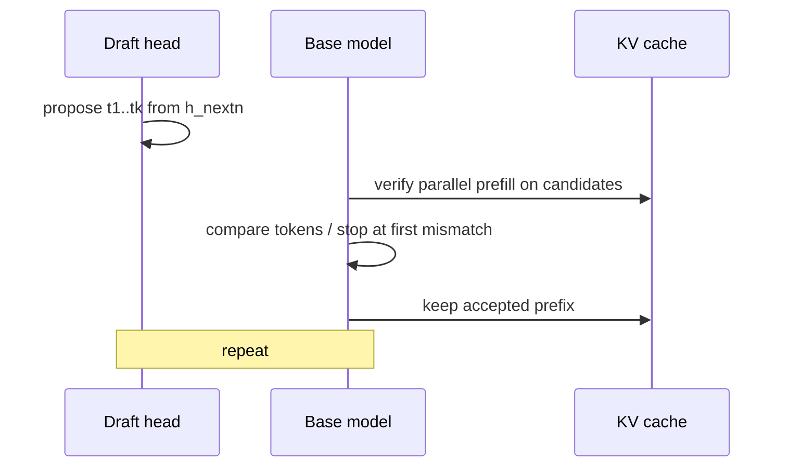

# 14 — MTP (Multi-Token Prediction / Speculative Decode)

## One-sentence summary

A small **draft head** proposes several future tokens; the **base model verifies**
them in one (batched) forward; accepted prefix advances KV as if generated
normally — raising tok/s when accept rate × draft length beats verify cost.

Files: `speculative.rs`, `gemma4_mtp.rs`, `mtp_serve.rs`, draft pieces in
`gemma4_gpu_model.rs` verify paths. Experiments: `AGENTS.md` MTP M1–M7.

---

## Loop

Effective speedup ≈ `accepted_tokens / (draft_cost + verify_cost)` per cycle.

---

## Components

| Piece | Role |
|-------|------|
| `MtpDraftHead` | Extra layers/head loaded from `--mtp` GGUF |
| `Gemma4MtpAssistant` | draft_first / chain API |
| `forward_verify_parallel` | Default verify (batched prefill chunk) |
| Sequential / decode-batch verify | Opt-in slower paths for debug |
| `MtpScheduler` | **Serial** serve loop (no multi-slot CB) |

---

## Critical correctness lessons (study these)

1. **Scratch sized to `max_head_dim` (512)** not sliding 128 — M1.  
2. **h_nextn for Gemma4 is post-`output_norm`** (lm-head input), not pre-final-norm — M5.  
3. **Draft confidence** should use top-k softmax (llama.cpp top_k=10), not full vocab — M6.  
4. Verify attention: **tiled ext with low `TILED_EXT_MIN_Q`** — M4.  
5. Crosscheck: `MTP_VERIFY_CROSSCHECK=1` compares parallel vs sequential.

---

## Knobs

| Env | Meaning |
|-----|---------|
| `LLAMA_MTP_DRAFT_STEPS` | Max draft length |
| `LLAMA_MTP_ADAPTIVE` / `LLAMA_MTP_P_MIN` | Stop drafting early |
| `LLAMA_MTP_DRAFT_TOP_K` | Confidence normalization |
| `MTP_VERIFY_SEQUENTIAL` | Debug path |
| `MTP_TREE_SPEC` | Optional tree speculative (`draft_tree.rs`) |

---

## Why accept rate caps you

At ~42% accept and ~1.85 tok/forward, even “free” verify cannot exceed ~1.85×
single-decode economics. Improving draft quality beats micro-fusing gelu (M7).

---

## Checklist

- [ ] Draw draft → verify → accept.  
- [ ] Why MTP serve is serial.  
- [ ] State the h_nextn Gemma4 pitfall.  
- [ ] Name one verify optimization that mattered (tiled ext / batched lm_head).

**Next:** [15_optimization_lab.md](15_optimization_lab.md)
